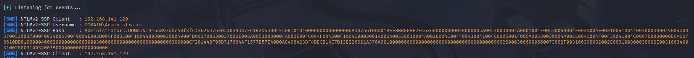

# Active Directory Lab

## Overview

This is a personal Active Directory lab built to practice common enterprise attack techniques in a controlled environment.

The lab currently consists of a Windows Domain Controller with domain users and service accounts. It is designed to simulate common AD security weaknesses and provide a practical environment for testing enumeration, credential attacks, lateral movement and privilege escalation techniques.

This page provides a quick overview of some of the techniques currently tested within the lab.

> Note: This is a small demonstration of the lab's current capabilities. I intend to expand it further by adding more users, machines, network segmentation for pivoting practice, and additional vulnerabilities to better simulate a real enterprise environment.

---

# Lab Scenarios

## NTLM Credential Capture & Cracking

Using Responder, an attacker can capture NetNTLMv2 authentication hashes when a user is tricked into authenticating to a malicious service.

### Start Responder
```
sudo responder -I eth0 -dwv
```
### Identify Captured Hash



### Identify Hash Type
