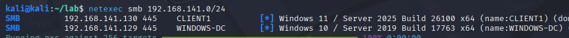
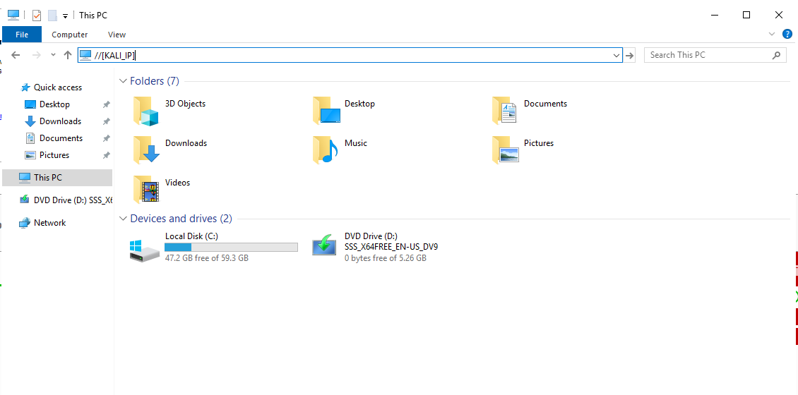
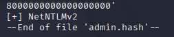
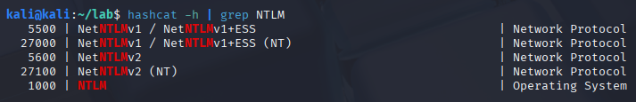
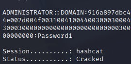
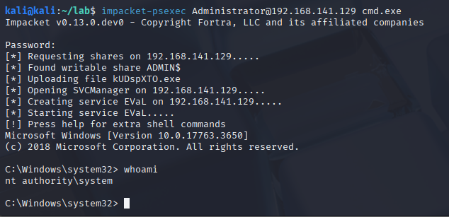
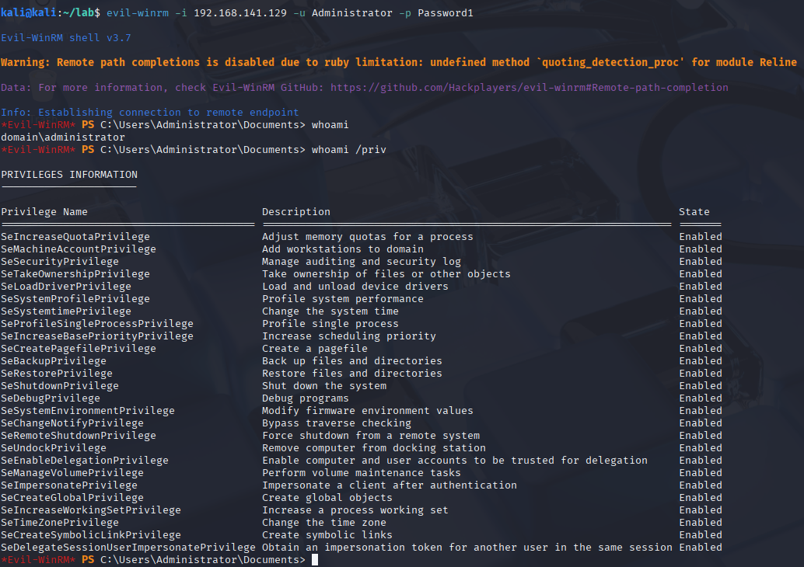

# Active Directory Lab

## Overview

This page provides a brief overview of selected attack scenarios demonstrated within my Active Directory lab environment.

The purpose of this section is not to provide an exhaustive list of all techniques tested within the lab, but rather to demonstrate how individual security weaknesses can be chained together during an Active Directory assessment.

A single compromised credential can often become the starting point for further attacks, potentially leading to increased privileges, access to additional systems, and ultimately compromise of the wider domain environment.

The examples below demonstrate a selection of techniques including credential capture, password cracking, remote access, credential extraction, password spraying, service account attacks, and pass-the-hash authentication.

> Note: This is a small demonstration of the lab's current capabilities. I intend to expand it further by adding more users, machines, network segmentation for pivoting practice, and additional vulnerabilities to better simulate a real enterprise environment.

---

# Lab Environment

| Machine | Role | Operating System |
|---|---|---|
| WINDOWS-DC | Domain Controller | Windows Server 2019 |
| CLIENT1 | Domain Workstation | Windows 11 |
| KALI | Attacker Machine | Kali Linux |

Domain: DOMAIN.local

---

# 1. Host Discovery & Enumeration

## Objective

Identify available systems and discover information about the Active Directory environment.

Before performing attacks, an attacker must first understand the network layout, available hosts, and exposed services.

## SMB Host Discovery

`NetExec` can be used to identify Windows hosts, SMB availability, and domain information.
```
netexec smb 192.168.141.0/24
```



Findings:
- Domain Controller
- Windows Host
- SMB services
- Domain Information

This information can be used to identify potential targets for further enumeration and exploitation.

# 2. NTLM Credential Capture & Cracking

## Objective

Demonstrate how weak authentication configurations can allow credential recovery through NTLM authentication attacks.

## Capturing NetNTLMv2 Hashes

`Responder` was used to capture authentication attempts within the network.

### Start Responder
```
sudo responder -I eth0 -dwv
```

### Trigger Authentication

An authentication request was triggered, causing the victim machine to attempt authentication.



### Identify Captured Hash

Responder captured a NetNTLMv2 authentication hash.


### Identify Hash Type

Hash identification tools can be used to determine the correct cracking mode.

```
hashid admin.hash
```



Finding hashcat mode:
```
hashcat -h | grep NTLM
```



### Crack NeNTLMv2 Hash

NetNTLMv2 hashes can be cracked using `Hashcat`:
```
hashcat -m 5600 admin.hash /usr/share/wordlists/rockyou.txt
```



# 3. Remote Access & Lateral Movement

## Objectve 

Demonstrate how compromised credentials can be used to access Windows systems remotely.

### SMB Remote Shell (PsExec)

Using administrative credentials, an attacker can obtain command execution through SMB.
```
impacket-psexec Administrator@192.168.141.129 cmd.exe
```



### WinRM Remote Access

Windows Remote Management provides another method of remote command execution.
```
evil-winrm -i 192.168.141.129 -u Administrator -p Password1
```



# 4. Domain Credential Extraction

# 5. Password Spraying

# 6. Service Account Attacks

# 7. Pass-the-Hash

# Future Lab Expansion

The current environment provides a foundation for practising Active Directory attacks. Future improvements will include:

- Additional domain users with different privilege levels
- Multiple domain-joined machines for lateral movement scenarios
- Network segmentation for pivoting practice
- Additional vulnerable configurations and attack paths
- Kerberoasting
- AS-REP Roasting
- BloodHound attack path analysis
- ACL abuse
