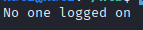
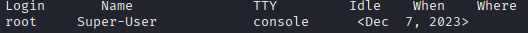
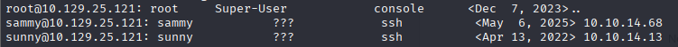

# TCP 79 (Finger)

## Overview 

Port 79 is used for the Finger protocol, a legacy service that provides information about users on a system. If enabled, it may disclose usernames, login status, home directories, shell information, or other account details. During enumeration, a Finger service can help identify valid user accounts and gather information useful for further reconnaissance or authentication-based attacks, particularly on older or misconfigured systems.

---
A protocol that returns information about logged on users such as usernames, real names, home directories and shell information

We can exploit through user enumeration, information disclosure and system reconnaissance 
https://www.pentestpad.com/port-exploit/port-79-finger-finger-protocol

User enumeration
```
finger @10.129.25.121
```


```
finger root@10.129.25.121
```


- To see what a valid response would look like 

Installing finger-user-enum.pl a user enumeration tool from pentest monkey
https://pentestmonkey.net/tools/user-enumeration/finger-user-enum

After downloading
```
tar -xvzf finger-user-enum-1.0.tar.gz
```

Using the names.txt wordlist from seclist as we do not have any usernames to go off of yet
```
./finger-user-enum.pl -U /usr/share/seclists/Usernames/Names/names.txt -t 10.129.25.121
```


We have found 3 users, root, sammy and sunny 

