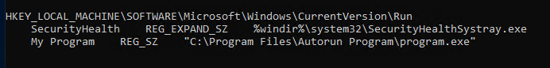
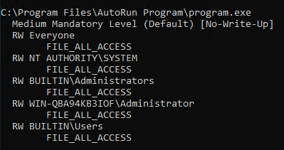
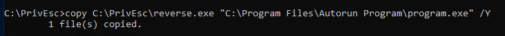

# AutoRun Services 

## Overview

AutoRun Services are programs that automatically execute when a user logs in or the system starts. These autorun entries may run with elevated privileges, making them a useful persistence or privilege escalation vector if misconfigured. If writable locations or insecure binaries are identified, they may be replaced or modified to execute malicious code.

---
Use accesschk.exe to check for permissions to binaries
.\accesschk.exe /accepteula -uwcqv [user]

Querying AutoRun services
reg query HKLM\SOFTWARE\Microsoft\Windows\CurrentVersion\Run

- Use accesschk.exe to see permissions

- This file is writable by everyone, we can overwrite this with a reverse shell

Now we restart our RDP session (or machine?) to trigger the shell 
