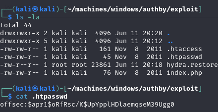
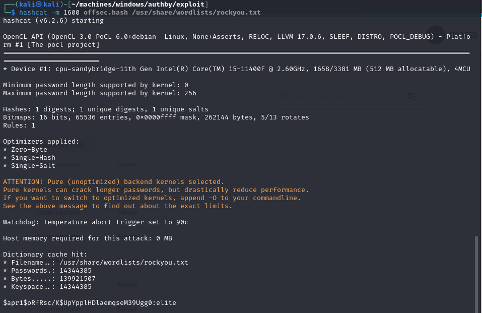
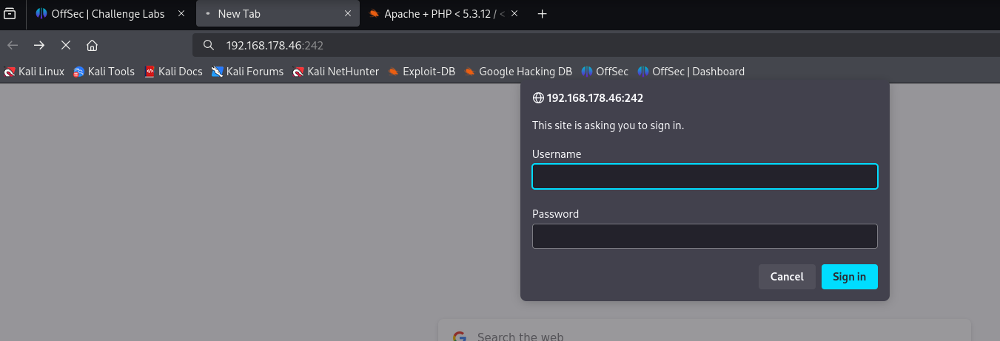
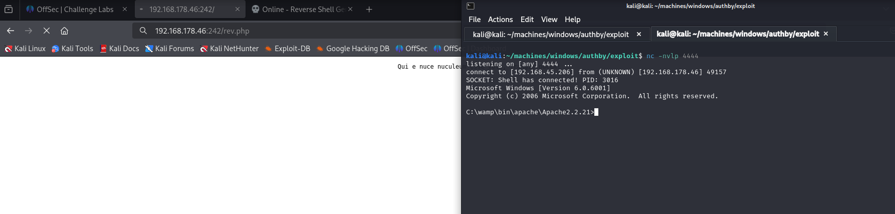
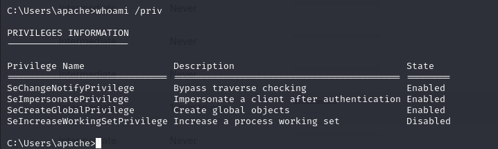
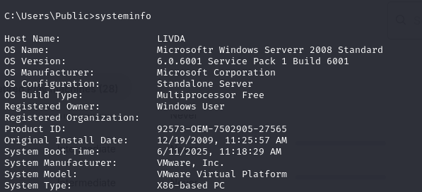
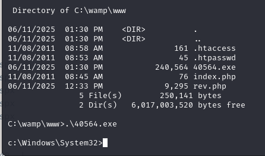
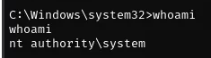

# Offsec Proving Grounds - Authby


## Overview

- Difficulty: Intermediate
- Community Rating: Hard
- Platform: Windows
- Skills Demonstrated: FTP Enumeration, Password Hash Cracking, Web Shell Deployment, Windows Privilege Escalation, Kernel Exploitation

## Methodology

The following methodology was conducted during this assessment:

- Enumeration
- Vulnerability Identification
- Initial Access
- Privilege Escalation
- Post Exploitation

---
## Enumeration 

Enumeration began with a comprehensive network scan to expose any open ports and services and identify attack vectors
```
nmap 192.168.178.46 -sCV -A -p-
```
```
Starting Nmap 7.95 ( https://nmap.org ) at 2025-06-11 19:22 BST
Nmap scan report for 192.168.178.46
Host is up (0.080s latency).
Not shown: 65531 filtered tcp ports (no-response)
PORT     STATE SERVICE       VERSION
21/tcp   open  ftp           zFTPServer 6.0 build 2011-10-17
| ftp-anon: Anonymous FTP login allowed (FTP code 230)
| total 9680
| ----------   1 root     root      5610496 Oct 18  2011 zFTPServer.exe
| ----------   1 root     root           25 Feb 10  2011 UninstallService.bat
| ----------   1 root     root      4284928 Oct 18  2011 Uninstall.exe
| ----------   1 root     root           17 Aug 13  2011 StopService.bat
| ----------   1 root     root           18 Aug 13  2011 StartService.bat
| ----------   1 root     root         8736 Nov 09  2011 Settings.ini
| dr-xr-xr-x   1 root     root          512 Jun 12 01:23 log
| ----------   1 root     root         2275 Aug 08  2011 LICENSE.htm
| ----------   1 root     root           23 Feb 10  2011 InstallService.bat
| dr-xr-xr-x   1 root     root          512 Nov 08  2011 extensions
| dr-xr-xr-x   1 root     root          512 Nov 08  2011 certificates
|_dr-xr-xr-x   1 root     root          512 Aug 03  2024 accounts
242/tcp  open  http          Apache httpd 2.2.21 ((Win32) PHP/5.3.8)
|_http-server-header: Apache/2.2.21 (Win32) PHP/5.3.8
| http-auth: 
| HTTP/1.1 401 Authorization Required\x0D
|_  Basic realm=Qui e nuce nuculeum esse volt, frangit nucem!
|_http-title: 401 Authorization Required
3145/tcp open  zftp-admin    zFTPServer admin
3389/tcp open  ms-wbt-server Microsoft Terminal Service
| rdp-ntlm-info: 
|   Target_Name: LIVDA
|   NetBIOS_Domain_Name: LIVDA
|   NetBIOS_Computer_Name: LIVDA
|   DNS_Domain_Name: LIVDA
|   DNS_Computer_Name: LIVDA
|   Product_Version: 6.0.6001
|_  System_Time: 2025-06-11T18:24:22+00:00
|_ssl-date: 2025-06-11T18:24:27+00:00; -1s from scanner time.
| ssl-cert: Subject: commonName=LIVDA
| Not valid before: 2024-08-01T20:34:50
|_Not valid after:  2025-01-31T20:34:50
```

Key Findings:
- Port 21 - FTP
- Port 242 - HTTP (Apache)
- Port 3389 - RDP
- FTP Anonymous FTP login allowed

The FTP service was prioritised as the initial point of enumeration because anonymous FTP login was enabled. Successful access may lead to the exposure of sensitive information such as; the systems directory structure, disclosure of configuration files, or even permit file uploads.
```
ftp 192.168.178.46
```


Anonymous FTP access revealed several files: `acc[Offsec].uac`, `acc[anonymous].uac`, `acc[admin].uac`. These filenames disclosed potential usernames that could be used for subsequent authentication or brute forcing attempts.

The discovery of the `admin` username prompted further enumeration and so common default credentials were used to to authenticate to the FTP server. Successful authentication was established with the credentials `admin:admin`.


The discovery of `index.php` and `.htaccess` suggested that the FTP server exposed the document root of a web server. Files uploaded could be potentially served by the web server leading to possible remote code execution.

Further examination also revealed a `.htpasswd` file containing the password hash for the `Offsec` user



## Password Cracking

The retrieved hash was saved locally for offline password cracking. `hashid` was used to identify the hash type, and the appropriate Hashcat mode was selected using `hashcat --help`.
```
└─$ hashid offsec.hash
--File 'offsec.hash'--
Analyzing '$apr1$oRfRsc/K$UpYpplHDlaemqseM39Ugg0'
[+] MD5(APR) 
[+] Apache MD5 
--End of file 'offsec.hash'--
```
```
┌──(kali㉿kali)-[~/machines/windows/authby/exploit]
└─$ hashcat --help | grep -i "md5"   
1600 | Apache $apr1$ MD5, md5apr1, MD5 (APR)
```
`Hashcat` was then used to crack the hash, revealing the plaintext password



## Initial Access

After obtaining a set of credentials, I proceeded to explore the HTTP service on port 242. Navigating to the service presented a login prompt, which was successfully bypassed using our new credentials `offsec:elite`.



Following successful authentication to the web application, I returned to the FTP service, where I had access to the web server's document root. A `Netcat` listener was setup then a PHP reverse shell was uploaded and executed through the HTTP service, resulting in remote code execution and the initial foothold on the target system 



## Privilege Escalation

Once an initial foothold was established, system privileges were enumerated. The current user was found to have `SeImpersonatePrivilege` assigned, privilege escalation was attemptted via a potato-based exploit (Godpotato) but proved unsuccessful. 



Switching attack vectors, further enumeration of the system using `systeminfo` revealed that an older Windows Server version was being run on the target, indicating a potentially vulnerable kernel.



A known kernel exploit was identified via Exploit-DB (MS11-046/ CVE-2011-1249) and compiled locally.

This exploit works by abusing a flaw in the AFD driver to execute kernel-level code. It replaces the current process token with a SYSTEM token, granting full administrative privileges

Source: https://www.exploit-db.com/exploits/40564
```
i686-w64-mingw32-gcc -o 40564.exe 40564.c -lws2_32
```

The binary was then transferred to the target via FTP and executed, resulting in elevated SYSTEM privileges





## Conclusion

Initial access was achieved via FTP enumeration, leading to credential discovery enabling remote code execution through a file upload vulnerability. Further privilege escalation was achieved by leveraging a kernel exploit (MS11-046), resulting in SYSTEM-level access and full system compromise.

## Lessons Learned

This machine reinforced how quickly weak credentials can lead to a full system compromise when combined with poor access control. 

Although `SeImpersonatePrivilege` was present, attempts using the Potato-based attack (GodPotato) were unsuccessful. This was likely due to the target running the older Windows Server 2008 system, where alternative techniques such as JuicyPotato would have been more appropriate.

Overall, this machine demonstrated the importance of validating appropriate exploitation paths and exposing how systems can be exposed to multiple privilege escalation vectors. 

## Remediation

To mitigate the vulnerabilities identified in this assessment, the following actions should be taken:

- Disable anonymous FTP access and ensure proper authentication is enforced
- Remove sensitive files from web root directories
- Restrict web upload functionality or impose file validation to prevent execution of uploaded content
- Apply all relevant security patches to address known kernel-level vulnerabilities such as MS11-046 (CVE-2011-1249)
- Implement least privilege principle where privileges such as SeImpersonatePrivilege are not required
