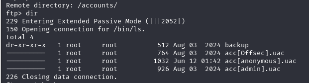

# Offsec Proving Grounds - Authby


## Overview

- Difficulty: Intermediate
- Platform: Windows
- Skills Demonstrated: FTP Enumeration, Password Hash Cracking, Web Shell Deployment, Windows Privilege Escalation, Kernel Exploitation

## Methodology

The following methodology was conducted during this assessment:

    Enumeration
    Vulnerability Identification
    Initial Access
    Privilege Escalation
    Post Exploitation

    ---
## Enumeration 

Enumeration began with a comprehensive network scan to expose any open ports and sevices and identify attack vectors
```
nmap 192.168.178.46 -sCV -A -p-
```
```
Starting Nmap 7.95 ( https://nmap.org ) at 2025-06-11 19:22 BST
Nmap scan report for 192.168.178.46
Host is up (0.080s latency).
Not shown: 65531 filtered tcp ports (no-response)
PORT     STATE SERVICE       VERSION
21/tcp   open  ftp           zFTPServer 6.0 build 2011-10-17
| ftp-anon: Anonymous FTP login allowed (FTP code 230)
| total 9680
| ----------   1 root     root      5610496 Oct 18  2011 zFTPServer.exe
| ----------   1 root     root           25 Feb 10  2011 UninstallService.bat
| ----------   1 root     root      4284928 Oct 18  2011 Uninstall.exe
| ----------   1 root     root           17 Aug 13  2011 StopService.bat
| ----------   1 root     root           18 Aug 13  2011 StartService.bat
| ----------   1 root     root         8736 Nov 09  2011 Settings.ini
| dr-xr-xr-x   1 root     root          512 Jun 12 01:23 log
| ----------   1 root     root         2275 Aug 08  2011 LICENSE.htm
| ----------   1 root     root           23 Feb 10  2011 InstallService.bat
| dr-xr-xr-x   1 root     root          512 Nov 08  2011 extensions
| dr-xr-xr-x   1 root     root          512 Nov 08  2011 certificates
|_dr-xr-xr-x   1 root     root          512 Aug 03  2024 accounts
242/tcp  open  http          Apache httpd 2.2.21 ((Win32) PHP/5.3.8)
|_http-server-header: Apache/2.2.21 (Win32) PHP/5.3.8
| http-auth: 
| HTTP/1.1 401 Authorization Required\x0D
|_  Basic realm=Qui e nuce nuculeum esse volt, frangit nucem!
|_http-title: 401 Authorization Required
3145/tcp open  zftp-admin    zFTPServer admin
3389/tcp open  ms-wbt-server Microsoft Terminal Service
| rdp-ntlm-info: 
|   Target_Name: LIVDA
|   NetBIOS_Domain_Name: LIVDA
|   NetBIOS_Computer_Name: LIVDA
|   DNS_Domain_Name: LIVDA
|   DNS_Computer_Name: LIVDA
|   Product_Version: 6.0.6001
|_  System_Time: 2025-06-11T18:24:22+00:00
|_ssl-date: 2025-06-11T18:24:27+00:00; -1s from scanner time.
| ssl-cert: Subject: commonName=LIVDA
| Not valid before: 2024-08-01T20:34:50
|_Not valid after:  2025-01-31T20:34:50
```

Key Findings:
- Port 21 - FTP
- Port 242 - HTTP (Apache)
- Port 3389 - RDP
- FTP Anonymous FTP login allowed

The FTP service was prioritsed as the initial point of enumeration because anonymous FTP login was enabled. Successful access may lead to the exposure of sensitive information such as; the systems directory structure, disclosure of configuration files, or even permit file uploads.
```
ftp 192.168.178.46
```



Anonymous FTP access revealed several files: `acc[Offsec].uac`, `acc[anonymous].uac`, `acc[admin].uac`. These filenames disclosed potential usernames that could be used for subsequent authentication or brute forcing attempts.

The discovery of the `admin` username prompted further enumeration and so common default credentials were used to to authenticate to the FTP server. Successful authentication was established with the credentiasl `admin:admin`.


The discovery of `index.php` abd `.htaccess` suggested that the FTP server exposed the document root of a web server. Files uploaded could be potentially served by the web server leading to possible remote code execution.

Further examination also revealed a `.htpasswd` file containing the password hash for the `Offsec` user

## Password Cracking

## Initial Access

## Privilege Escalation

## Conclusion

## Lessons Learned

## Remediation
